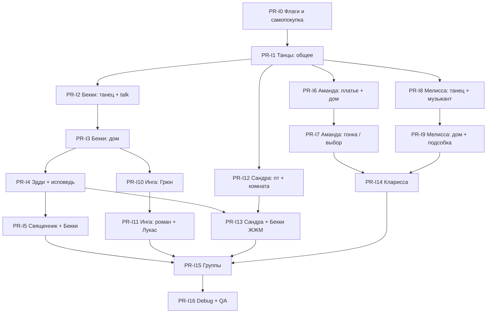

# Арка близости: девушки, тайминг, группы

**Статус:** дизайн согласован (**Бекки → Инга**). QSP акт 1 — **реализован** в `f27d9fd` (PR-I6…I16); ручной QA — `docs/qa-checklist-intimacy-act1-weeks1-8.md`.  
**Код:** smoke-test — Дебаг → **Intimacy smoke-test**; пресеты — **Intimacy-арки (акт 1)**.
**Связанные документы:** `docs/handoff.md` (экономика), `docs/design-mayor-seal-corruption-arc.md` (снятие запретов), `docs/design-port-church-arc.md` (Лизетта), `AGENTS.md` (шкалы).

---

## Глобальные правила

| Правило | Решение |
|---------|---------|
| Беременность | **Нет** — `PregnancyCheck` и тексты legacy не переносить |
| Оргазм ГГ | `RegisterPlayerCum`, `max_daily_cum = 2` |
| Пятничные танцы | **Общий блок** для всех девушек; образец цепочки — Бекки / `amanda_dance.qsps` |
| Угощение на танцах | Вино / пиво / еда → **+коррупция и +откровенность** всем девушкам на площади |
| Первый секс с ГГ | Только **дома** (комната сестры / дом NPC / трактир — по ветке) |
| Первый секс в подворотне | Только **ключевой NPC** ветки (см. таблицу ниже) |
| Секс на площади | **Нет** — эскалация на площади, акт в подворотне или доме |
| `qsp-project.json` | Не менять без явной просьбы |

### Таблица «первый секс»

| Девушка | ГГ (player-path) | NPC в подворотне | Подворотня с ГГ |
|---------|------------------|------------------|-----------------|
| **Аманда** | только дома | **Легаре**; соседские парни — **после** первого | секс с ГГ — **после** домашнего первого |
| **Мелисса** | только дома | **музыкант** | увести в подворотню — **после** домашнего первого с ГГ |
| **Бекки** | дом Бекки (после танцев) | — | — |
| **Сандра** | **`SandraRoom`** (трактир); позже — по ветке | **Драупнир** (с старта игры); **мэр** — эпизодически | нет подворотни / танцев |
| **Кларисса** | лавка / дом Легаре / мэрия? | **Легаре** (муж) — с старта брака | по ветке ревности |
| **Инга** | **комната Инги** (дом Бекки) после танцев; раньше — подсобка лавки (стражник) | **Грюн** (стражник), если ГГ не выкупил ветку | с площади после приглашения на танец |

Гонка: если ГГ медлит с домашним первым, ключевой NPC (Легаре / музыкант) может опередить в подворотне.

### Экономика (ориентир для тайминга)

| Параметр | Значение |
|----------|----------|
| Валовый доход / день | ~341 мараведи |
| Свободно после закупки и налога | ~**81**/день |
| Ранний пакет крупных трат | ~1600–1800 за **3–4 недели** (без спешки) |
| Платье для танцев (план) | 60–90 у Ирмы; в handoff: **70×2 = 140** на обеих сестёр |
| Сцена трактира | **250**, 3 дня (`TavernUpgradeStageDone`) |

**Быть первым у Аманды и Мелиссы:** деньгами **реально** (~390 на платья + сцена ≈ 5 дней копилки); по времени — **да**, если в неделях **3–5** приоритет домашней близости с Амандой (у неё слабая защита от Легаре). У Мелиссы сильная защита: подворотня с ГГ закрыта до домашнего секса, но музыкант всё равно может забрать первый секс в подворотне, если ГГ тянет — обычно не раньше **6-й пятницы (д.40)**.

**Самопокупка платья (если ГГ не купил):**

| Девушка | День | Зачем |
|---------|------|--------|
| Аманда | **28** (4 недели) | первая пятница в платье без ГГ = **д.33**; до этого — ограниченный танец |
| Мелисса | **35** (5 недель) | неделя форы; полные танцы с **д.40** |

Условие разговора о покупке: `Friends > 8` (legacy `IntMelissaDressChange` / Amanda analog). Это **мягкий дедлайн** (разговор + покупка в свой день), не мгновенный проигрыш гонки.

---

## Единый таймлайн (акт 1, intimacy)

Календарь: старт **1 января 1100, понедельник**; `dayspassed` = дни с начала; `week` = день недели (**1** пн … **5** пт танцы … **7** вс церковь). Части дня: утро / полдень / вечер / ночь.

**Свободно ~81 м/день** после закупки (см. выше). Крупные траты ранней игры конкурируют — в таблице указаны **типичные** сроки, не жёсткие гейты кода.

**Принцип темпа:** не торопить игрока. Окна ниже — ориентир для **фокусного** маршрута; при таверне, закупках и «равномерной» игре вехи сдвигаются на **+2–3 недели** без потери смысла. Самопокупка платья — мягкое напоминание; гонка с NPC наступает только после **нескольких** пятниц в платье / с угощениями.

### Сводка вех (дни)

| День | Событие | Сумма / примечание |
|------|---------|-------------------|
| **1–4** | Назначить работы, первая прибыль, talk в лавках | копилка |
| **3** | **Среда:** корабль в порту; witness **Аманда + Лизетта** (если ГГ у причала) | `design-port-church-arc` этап A |
| **5** | **1-я пятница:** танцы; Бекки на площади; Сандра → **Драупнир** | без платья сестёр — слабое меню танца |
| **7** | **1-е воскресенье:** служба; исповедь полдень | порт-церковь D+ |
| **~18–25** | Платья **70×2** и/или **сцена 250** | ~390 м ≈ 5 дней копилки; можно позже |
| **28** | **Аманда** сама покупает платье, если ГГ не купил | 1-я пятница «в платье» без ГГ = **д.33** |
| **33** | **5-я пятница** — окно **гонки Аманда** (ГГ дом / Легаре подворотня) | NPC быстрее при `slut`+танцы+угощения |
| **35** | **Мелисса** сама покупает платье | полные танцы с **д.40** |
| **40** | **6-я пятница** — окно **гонки Мелисса** (дом / музыкант) | нужна **сцена** для подсобки |
| **42+** | Ветки **Бекки+Эдди**, **Инга+Грюн**, комната **Сандры** | параллельно, без жёсткого дедлайна |

### Приоритет трат (ранняя игра)

| Стратегия | Покупки | Эффект |
|-----------|---------|--------|
| **Сестры первые** | платья **140** к **д.25** | Аманда/Мелисса на 4–5-й пятнице; сцена позже → музыкант сильнее |
| **Сцена рано** | **250** к **д.21–28** | Мелисса+музыкант в трактире; платья сами на **28/35** |
| **Бекки/Инга** | угощения на танцах, **30** пожертвование Эдди | меньше копилки на платья — сестры уязвимы к NPC, но с задержкой **недели+** |

### Неделя за неделей (ориентир)

#### Неделя 1 (дни 1–7)

| Трек | Что происходит |
|------|----------------|
| Таверна | работы, закуп у **Бекки**/**Легаре**, первый доход |
| **Бекки** | talk лавка; **пт.5** 1-й танец (нужно `Friends≥5`, `slut≥8` для танца) |
| **Сёстры** | talk; harassment в зале; **пт.5** на площади без платья — болтовня/ограниченный танец |
| **Сандра** | кухня; **пт.5** визит к **Драупниру** (фон NPC-path) |
| **Порт** | **ср.3** witness Лизетта (опционально) |
| **Церковь** | **вс.7** служба — фон, слухи |

#### Неделя 2 (дни 8–14)

| Трек | Что происходит |
|------|----------------|
| Экономика | копилка; платья/сцена **без спешки**; взятка **Инге 180** ещё не горит |
| **Аманда** | 2-я пятница; harassment, talk; Легаре на площади — флирт, не финал |
| **Мелисса** | 2-я пятница; контроль зала; ревность к Аманде |
| **Бекки** | 2-й танец → талия/попа; **BeckyInviteHome** ещё рано (нужна **4-я** пт) |
| **Инга** | мелькание в лавке; на танцах **ждёт Лукаса** — роман не стартовал |
| **Кларисса** | закупки вина → отношения |

#### Неделя 3 (дни 15–21)

| Трек | Что происходит |
|------|----------------|
| **Аманда** | **3-я пятница (д.19):** harassment, talk, Легаре — флирт |
| **Мелисса** | 3-я пятница; без сцены — музыкант только флирт |
| **Бекки** | **3-й танец**; talk лавки (IngaStory, HusbandStory) |
| **Инга** | мелькание; на танцах **ждёт Лукаса** |
| **Сандра** | фон **Драупнир**; комната ещё рано |

#### Неделя 4 (дни 22–28)

| Трек | Что происходит |
|------|----------------|
| **Аманда** | **4-я пятница (д.26):** эскалация, Лизетта-talk — **ещё не пик** гонки |
| **Мелисса** | 4-я пятница; музыкант слабый без платья/сцены |
| **Бекки** | **4-й танец**; с **д.26** возможен **BeckyInviteHome** |
| **Инга** | знакомство на танцах; роман ещё не открыт |
| **Сандра** | 1-й шаг **SandraRoom** (отдельная ночь) |
| **д.28** | Аманда **сама** покупает платье (если нет от ГГ) |

#### Неделя 5 (дни 29–35)

| Трек | Что происходит |
|------|----------------|
| **Аманда** | **5-я пятница (д.33):** пик **NPC-first** — Легаре подворотня; player-path: уйти с танцев → дом **`TavernAmandaRoom`** |
| **Мелисса** | 5-я пятница; без платья Мелиссы — ограниченный танец |
| **Бекки** | **1-й секс ГГ** (д.33–35) при фокусе; `BeckyHomeSex=1`; крыльцо **Инга+Лукас** |
| **Инга** | **1-я жалоба** Грюна в лавке → сторожка |
| **Сандра** | 1–2 шага **SandraRoom** |
| **д.35** | Мелисса **сама** покупает платье |

#### Неделя 6 (дни 36–42)

| Трек | Что происходит |
|------|----------------|
| **Мелисса** | **6-я пятница (д.40):** с **сценой** — пропажа в зале / музыкант; гонка дом vs подворотня |
| **Бекки** | повторные визиты; старт **Эдди** (подворотня при `Friends['Eddie']≥8`) |
| **Инга** | ветка **А/Б/В** Грюна (**180+180** ≈ 4–5 дней копилки) |
| **Порт–церковь** | Жоржетта B→C; воскресные spy |
| **Кларисса** | после **Аманда+Легаре** — порог 1-го секса с ГГ |

#### Неделя 7 (дни 43–49)

| Трек | Что происходит |
|------|----------------|
| **Бекки+Эдди** | подворотня ×2 → talk Эдди → talk Бекки → священник **30 м** → **вс.** исповедь → сцена дома |
| **Инга** | ветка **А/Б:** 1-й секс с ГГ; **В:** подсобка Грюна |
| **Аманда** | player/NPC **выбор**; анал-гейт **Лизетта** (много talk) |
| **Сандра** | продолжение комнаты; воскресенье у лавки Бекки |

#### Неделя 8 (дни 50–56)

| Трек | Что происходит |
|------|----------------|
| **Бекки** | `BeckyEddieDone`; **анал** (моряки); **BeckyPriestArcOpen** |
| **Инга** | **Лукас** ММЖ #1–2; огурцы; `IngaDanceUnlocked` |
| **Мелисса** | анал-ветка; ММЖ+музыкант при высокой коррупции |
| **Сандра** | вагинал в комнате; **анал** — поздние шаги |

#### Недели 9–12 (дни 57–84) — поздний акт 1

| Трек | Окно |
|------|------|
| Группы | ЖЖМ **Аманда+Мелисса** (`FamilyCorruptionStage≥3`); ММЖ **Аманда+Легаре** |
| **Инга** | DP, **застук Бекки**, ЖЖМ **Бекки+Инга+ГГ** |
| **Сандра+Бекки** | ЖЖМ после `BeckyEddieDone` + воскресный скандал |
| **Кларисса** | анал после 5 сексов; группы с Легаре/Мелиссой |
| **Лизетта** | церковная intim-цепочка; ЖЖМ с Амандой |
| Мэр / налог | параллельно `handoff` (~600 налога, взятка **180**) — не блокирует intimacy, но отнимает копилку |

### NPC-first: когда NPC может опередить ГГ

| Девушка | Ранний риск | Типичное окно | Что замедляет NPC |
|---------|-------------|---------------|-------------------|
| **Аманда** | **Легаре** | **5-я пятница (д.33+)** | домашний секс до подворотни; запрет парней; низкая коррупция |
| **Аманда** | соседские парни | после 1-го секса Легаре | `Caught`, запрет |
| **Мелисса** | **музыкант** | **6-я пятница (д.40+)** | домашний 1-й секс; **запрет** встреч; нет **сцены** — только подворотня |
| **Инга** | **Грюн** | после 2-й жалобы без оплаты (**ветка В**) | **180+180** или rep≥60 |
| **Сандра** | **Драупнир** | **с 1-й пятницы** (фон) | не гонка «первый секс»; ГГ догоняет лестницей комнаты **недели 5–12** |
| **Кларисса** | **Легаре** (муж) | с брака | ГГ не в гонке — вход через ревность |
| **Бекки** | — | нет | только player-path |

### Параллельные календарные слоты (не intimacy, но делят время ГГ)

| Слот | Частота | Документ |
|------|---------|----------|
| Пятница вечер | танцы **все** девушки на площади | этот файл |
| Пятница вечер | Сандра у **гнома** | Сандра §2 |
| Воскресенье утро | служба | `design-port-church-arc` |
| Воскресенье полдень | исповедь + spy (Бекки, Жоржетта, Лизетта) | порт-церковь + Бекки §7 |
| Воскресенье день/вечер | визиты (**Сандра** у Бекки, **Кларисса+Мелисса**) | `sunday_shop_visits` |
| Среда | корабль (**1-я** — witness; далее — товар) | порт |
| Вторник ночь | Древо (лор, опционально) | `import-traktir-legacy` |

### Три «маршрута» игрока (для баланса)

```mermaid
gantt
    title Act 1 intimacy (дни, медленный ориентир)
    dateFormat X
    axisFormat %d

    section Сёстры
    Платья 140           :a1, 0, 25
    Сцена 250            :a2, 12, 28
    Аманда 1-й секс ГГ   :a3, 30, 42
    Мелисса 1-й секс ГГ  :a4, 38, 50

    section Бекки
    Танцы эскалация      :b1, 4, 33
    1-й секс ГГ          :b2, 30, 40
    Ветка Эдди           :b3, 40, 55

    section Инга
    Жалоба Грюн          :c1, 28, 38
    Взятка 360           :c2, 32, 42
    1-й секс ГГ ветка А  :c3, 42, 55
```

| Маршрут | Фокус | Плюс | Минус |
|---------|-------|------|-------|
| **Семья** | Аманда **д.30–42**, Мелисса **д.38–50** | сюжет трактира, Легаре/музыкант | Бекки/Инга сдвигаются на нед. 8–9 |
| **Бекки** | танцы + угощения **нед. 2–5** | секс ~**д.33**, Эдди к **д.50** | Легаре может забрать Аманду на **д.33** |
| **Равномерно** | чередовать пт/вс | меньше NPC-first сюрпризов | всё на **нед. 8–10**, нужна дисциплина копилки |

---

## Общая схема player-path / NPC-path

Две параллельные шкалы на девушку (`GirlPlayerPath`, `GirlNpcPath` + именные алиасы в `AGENTS.md`).

**«Первый выбор player/NPC path»** — отдельный сюжетный узел после того, как NPC-path **заметен** (подсмотрел, пропажа, разговор). Не взаимоисключение навсегда, а явная позиция ГГ:

1. **Player** — добиваться самому → рост player-path, домашний роман  
2. **Запрет** — запретить встречи с NPC → конфликт / дисциплина, NPC реже  
3. **NPC / наблюдение** — не мешать, подсматривать → рост NPC-path  

Поздняя арка мэра: `PlayerCantForbidGirlMeetings = 1` снимает запреты глобально.

---

## Бекки

### Характер ветки

**Вдова**, 33, лавка на площади. **Только player-path** с ГГ (нет гонки «первый секс» с NPC). Темп: **talk медленно**, **пятничные танцы быстрее**. Семья на фоне: **Инга**, **Эдди**, младшие дети. Не работница трактира; роман **не** через кухню/зал.

Старт: `Friends['becky']=8`, `sluttiness['becky']=25` (`becky.qsps`).

### 1. Talk в лавке (полдень–вечер)

| Цепочка | Гейт | Содержание |
|---------|------|------------|
| Болтовня | всегда | +`Friends`, +`otkroven`; пороговые `#BeckyOtkroven15/25/35/45` (`becky_events.qsps`) |
| **IngaStory** 1→4 | `Friends>6` … | дочь, Лукас, жених (`talk_with_becky.qsps`) — задел ветки **Инги** |
| **HusbandStory** 1→5 | `Friends>13` … | Эрик, подруги, разврат вдовы — гейт **приглашения в гости** |
| **EddieStory** 1→2 | `Friends>6`, Жоржетта | сын, игра «мамочка» — стыкуется с веткой **Эдди** |
| Фон лавки | `sluttiness` средняя+ | редко: **огурец** / грузчик / **Легаре** на складе (`BeckyLoversInStore`, упростить; **без** беременности) |

### 2. Приглашение в дом (без танцев)

Talk **«Попробовать напроситься в гости»** — legacy-квиз (муж, Инга, Эдди, **citydress**). Нужно **4 очка** из ответов + `Friends['becky']>12` + `BeckyHomeStage=2` (**четыре** пятницы с контактом на площади / танцах). Успех → `BeckyHomeStage=3` (можно стучаться вечером в **citydress**). Типично не раньше **4-й пятницы (д.26)**; 1-й секс — **5-я пт (д.33)** и позже.

Вечерний визит без танца: стук в дверь → проверка платья → ужин с семьёй → спальня (медленнее, чем с танцев).

### 3. Пятничные танцы (`becky_dance.qsps`, legacy `IntBeckyDance`)

Бекки на `DanceHall` (`npc_city_schedule`). Цепочка **6 шагов** (`DanceMax=6`):

| Шаг | Действие | Порог (ориентир) |
|-----|----------|------------------|
| 1 | Пригласить потанцевать | отказ: `Friends<5` или `sluttiness<8`; да: `Friends≥5`, `slut≥8`; охотно: `Friends≥7`, `slut>18` |
| 2+ | Талия | `Friends≥7`, `slut>10` |
| | Попа | `Friends≥7`, `slut>18` |
| | Сжать попу | `Friends≥10`, `slut>20` |
| | Поцелуй | `Friends≥10`, `slut>21` → `KissDance` |
| | Продолжать танец | шаги 2–5, на шаге 3+ ролл `BeckyInviteHome` |

**Приглашение с танцев** (`BeckyInviteHome`): `Friends≥10`, `sluttiness>20`, `DanceStep≥3`, первый раз за вечер; при `BeckyHomeSex=1` и `slut>48` — откровенная реплика. Меню **«Принять»** → `BeckyHomeFront`, `FromDances`.

Угощение на площади → +`sluttiness` / `otkroven` (общее правило).

### 4. У крыльца (`BeckyHomeFront`)

`Rand(1,4)`: в **3 из 4** — **Инга + Лукас** (минет или секс в углу). Меню:

- подсмотреть один / показать Бекки / сделать вид, что пусто;
- с **танцев** (`FromDances`): Бекки может заметить → короткий talk;
- при `BeckyHomeStage<5` — торопит **внутрь**, пока дети заняты;
- при `BeckyHomeStage≥5` — можно **подойти к парочке** / досмотреть до конца (+коррупция Бекки и Инги).

Первый заход с танцев: `BeckyHomeStage=max(1)`.

### 5. Дом: первый и повторные визиты

| Режим | Условие | Содержание |
|-------|---------|------------|
| **С танцев, ранняя стадия** | `FromDances`, `BeckyHomeStage<5` | **Сразу в спальню** (тихо, без зрителей) — по согласованному дизайну |
| **Гость с улицы** | `guest`, `BeckyHomeStage≥3`, `citydress` | ужин (`IntBeckyGuest` **укороченно**: семья, Инга+Лукас за столом; **без** оргии Жоржетты) → спальня |
| **Повтор** | `BeckyHomeStage≥4`, `BeckyHomeSex=1` | чаще сразу спальня; talk «как прошлый визит» |

**Первый секс с ГГ** (`BeckyHomeSex=1`): `SexSceneStart` — **минет → дрочка грудью → вагинальный** (одна сессия или 2–3 narrative-шага, не полное legacy-меню). `RegisterPlayerCum` — да.

`BeckyHomeStage=4` после первого секса; `TimesVisited` +1 за ужин-визит.

### 6. Анал (моряки в лавке)

**Не** через овощи (овощи — у **Мелиссы**). Отдельная сцена:

| Параметр | Значение |
|----------|----------|
| Гейт | `BeckyHomeSex=1`; `sluttiness['becky']≥50`; `Friends['becky']≥12`; вечер или лавка «закрыта» |
| Триггер | ГГ заходит в лавку / подслушивает склад — **двое моряков** с Бекки (DP); legacy `StoreLover` тип **новый: sailors** |
| Подсмотр | меню: уйти / смотреть / (высокая коррупция) присоединиться позже |
| Итог | первый **анал** с ГГ — **отдельный визит** после подслушивания (Бекки стесняется → соглашается дома или в задней комнате); `analvirgin` в данных уже 0 — лор «давно пробовала», для ГГ акт **новый** этап в лестнице |

### 7. Священник + Бекки (после ветки Эдди)

Открывается при `BeckyPriestOk=1` + `BeckyEddieDone=1` → `BeckyPriestArcOpen=1`.

| Шаг | Когда | Содержание |
|-----|-------|------------|
| P1 | воскресенье, полдень | ГГ подслушивает: исповедь Бекки + секс с отцом Герхардом (укороченный `IntBeckyAfterCermon`, 3 экрана) |
| P2+ | раз в 1–2 недели | повтор; темы: вина вдовы, ГГ, **Эдди** (если done), пожертвования |
| Донат | опционально | +**15** мараведи в церковь → выше шанс сцены на следующем воскресенье |

Не блокирует арку Жоржетты/Лизетты (`design-port-church-arc.md`).

### 8. Группы и соседи

| Сцена | Гейт |
|-------|------|
| **ЖЖМ Сандра + Бекки + ГГ** | `BeckyEddieDone=1`, высокая коррупция обеих, воскресный визит + скандал — см. **Сандру** |
| **ЖЖМ Бекки + Инга + ГГ** | застук **ММЖ Инга+Лукас+ГГ** — см. **Ингу** |

### Флаги (Бекки)

`BeckyHomeStage` (0–5), `BeckyHomeSex`, `TimesVisited`, `IngaStory`, `HusbandStory`, `EddieStory`, `GeorgMention`, `BeckyPriestArcOpen`; для Эдди — см. ниже. Legacy `visitedhome`, `HomeSex` → **не использовать**, маппинг в `BeckyHomeStage` / `BeckyHomeSex`.

### Код / миграция

| Сейчас | Нужно |
|--------|--------|
| `talk_with_becky.qsps` | тексты квиза «в гости»; флаги Эдди (`BeckyEddieOutraged` …); убрать привязку к `EddieTryToFuck` |
| `becky_events.qsps` | пороги otkroven — ок |
| `friday_dance_core` | ветка на `becky_dance.qsps` |
| — | `modules/events/becky/becky_home_chain.qsps` + `_text` (Front, Home, Guest, sailors) |
| — | `modules/events/becky/becky_dance.qsps` |
| — | `modules/events/church/church_spy_becky.qsps` (P1+) |
| `TalkWithEddie` | stub → меню по ветке Эдди |

---

### Эдди (упрощённая ветка)

**Гейт ветки:** `BeckyHomeSex=1` (роман с ГГ начат). Параллельно talk **EddieStory** и подворотня.

Отдельная линия от романа ГГ+Бекки; legacy (`IntEddieTalk`, `BeckyEddieJoinFirst`, `PriestAdvice`, `GeorgettBeckyVisit`) **не переносить целиком** — только схема ниже.

**Не в v1:** беременность; `IntEddieBeckySex` с десятью пунктами меню; спонсорство Жоржетты на ужин (`EddieGeorg` / `EddieWhoreHome` / `GeorgettBeckyVisit`); legacy `PriestAdvice` 0–3 и рандом от `ChurchDonatedAmount`; фоновые `EddieHomeVisit` (Эдди+Жоржетта дома); ограбление Шервуда — опционально позже.

| Шаг | Условие (минимум) | Содержание |
|-----|-------------------|------------|
| **1. Знакомство** | утро, лавка (`time=0`) | `TalkWithEddie`: болтовня, +`Friends['Eddie']` |
| **2. Подворотня #1** | `Friends['Eddie']≥8`; `port_alley_spy` / переулок | **Эдди + Жоржетта** → `EddieSawGeorg=1` |
| **3. Подворотня #2** | `EddieSawGeorg=1`; +1–7 дней | ролевая игра «мамочка» → `EddieSawGeorg=2` |
| **4. Разговор с Эдди** | `EddieSawGeorg=2`, `Friends['Eddie']≥10` | обещание помочь → `EddieHelpPromised=1` |
| **5a. Talk с Бекки #1** | `BeckyHomeSex=1`; `EddieHelpPromised=1` | возмущение → `BeckyEddieOutraged=1` |
| **5b. Talk с Бекки #2** | `BeckyEddieOutraged=1` | ГГ советует сходить к **отцу Герхарду** (воскресная исповедь / полдень) и **не скупиться на пожертвование** → `BeckyPriestHint=1` |
| **5c. Исповедь** | `BeckyPriestHint=1`; воскресенье, полдень | Бекки исповедуется про сомнения с Эдди; отец говорит о «великом грехе». ГГ может **пожертвовать** **30** мараведи (`BeckyEddieDonationPaid`). **Без денег** → `BeckyPriestOk=0`. **С деньгами** → `BeckyPriestOk=1` |
| **5d. Talk с Бекки #3** | `BeckyPriestOk=0` | ГГ: «он тебя **не так понял**» — утешить, снова посоветовать сходить к священнику **с пожертвованием** → `BeckyPriestRetry=1` (повтор 5c доступен) |
| **6. Сцена дома** | `EddieHelpPromised=1` + `BeckyPriestOk=1`; визит в спальню | Упрощённый `BeckyEddieJoinFirst`: ГГ с Бекки, **открытая дверь** → Эдди. Бекки **не выгоняет** (благословение). МЖМ narrative **2–3 шага**. Если зашли **без** `BeckyPriestOk` — один провал (выгоняет сына и ГГ), подсказка «сначала священник»; повтор после 5d+пожертвования |
| **7. Нормализация** | после шага 6 | `BeckyEddieDone=1`; talk с Бекки/Эдди — «теперь так бывает»; порог **ЖЖМ Сандра+Бекки+ГГ** (см. Сандру); **открывает две побочные линии** (ниже) |

**Фон (шаг 8, только Эдди+Бекки):** раз в несколько дней таблица `TodaySexEvents` — **только** «Эдди трахает мать» (`EddieMom`), если `BeckyEddieDone=1`. Без Жоржетты на ужине, без детей за дверью.

### Что открывает ветка (после `BeckyEddieDone=1`)

| Линия | Гейт | Содержание |
|-------|------|------------|
| **Священник + Бекки** | `BeckyPriestOk=1` (уже в шаге 5c) + `BeckyEddieDone=1` | Постоянная ветка **отец Герхард ↔ Бекки**: воскресный полдень — исповедь / подслушивание ГГ (legacy `IntBeckyAfterCermon`, укороченно). Бекки ходит регулярно; сцены по коррупции Бекки; пожертвования **усиливают** частоту, но не обязательны каждый раз. Не путать с аркой Жоржетты/Лизетты в `design-port-church-arc.md`. |
| **Эдди — лучший друг** | `BeckyEddieDone=1` + `Friends['Eddie']` ≥ порог (напр. **18**) | Talk в лавке: Эдди благодарен за «помощь с мамой» → `EddieBestFriend=1`. Обещает ГГ **пользоваться его женой** — **отдельный NPC** (ещё не в игре, **задел на будущее**). В v1: только реплика-обещание + флаг `EddieWifeOffer=1`; сцены с женой — после появления персонажа. **Не** Жоржетта (она только подворотня, шаги 2–3). |

**Флаги:** `EddieSawGeorg` (0/1/2), `EddieHelpPromised`, `BeckyEddieOutraged`, `BeckyPriestHint`, `BeckyPriestRetry`, `BeckyPriestOk`, `BeckyEddieDone`, `BeckyPriestArcOpen`, `EddieBestFriend`, `EddieWifeOffer` (задел: жена Эдди — **отдельный NPC**, TBD). Пожертвование за ветку Эдди — отдельно от общего `ChurchDonatedAmount` legacy (`BeckyEddieDonationPaid`). Legacy `EddieTryToFuck`, `PriestAdvice`, `EddieGeorg`, `visitedhome=6/7` — **не использовать**.

**Жоржетта в ветке Эдди:** только шаги 2–3 (подворотня). **Жена Эдди** — другой персонаж, позже.

**TODO (не забыть):** NPC **жена Эдди**; при `EddieWifeOffer=1` — доступ ГГ к ней (сцены после введения в мир).

---

## Аманда

### Отношения и коррупция

- **Talk** — медленно; **танцы** — быстрее.  
- Коррупция: флирт, танцы, harassment, Легаре, откровенное платье (+отношения, открывает танцы).  
- **Лизетта** — главный двигатель коррупции; запреты замедляют, дают конфликты; подарки-извинения.  
- Платье: ГГ покупает или **сама на 28-й день**.

### Player-path (секс с ГГ)

Плавная лестница: обнимашки → поцелуи → петтинг → дрочка → минет → отлиз → вагинальный.  
Возможен **раньше Легаре**, на грани, легко упустить.

**Анал** — только через **Лизетту** (ГГ подслушивает разговоры **все**, не за один день). **Не** через овощи Бекки.

### Пятничные танцы

Цепочка (`amanda_dance.qsps`): танец → талия → попа → поцелуй → шея → подворотня.  
Можно **уйти с танцев** с Амандой (общая лестница близости).

| Механика | Правило |
|----------|---------|
| Низкая коррупция | **Комбо-гейт** (`FamilyCorruptionStage`, `sluttiness`/`otkroven`, `AmandaPublicAttention`, `AmandaSecretiveness`) → рандом **«давай уйдём»** в подворотню |
| Подворотня с ГГ | `modules/events/dance/amanda_dark_alley.qsps` + `_text`; после домашнего первого → `SexSceneStart` |
| Риск | `AmandaAlleyRiskCheck` → `AmandaAlleyCaught` |
| Горожане присоединяются | **А:** `Caught >= 2` **и** высокая коррупция → ММЖ в подворотне |
| Соседские парни | **Б:** «случайно наткнулись» — и после подворотни с ГГ, и при NPC-path; имена `$GermanMaleName[]`, роль «соседский парень»; legacy `#AmandaLoverSex`, `lovermeet` |

### NPC-path

- **Легаре** быстрее ГГ: дрочка → минет → секс после танцев.  
- Пропажа из зала → заметка при выходе **на улицу перед трактиром**.  
- Сначала Легаре, потом **соседские парни** (последовательно).  
- Выборы: подсмотреть / запретить / показать что смотришь / присоединиться (высокая коррупция).  
- Лизетта открывает эскалацию NPC: минет двоим → секс с двумя → с тремя.

### Легаре на танцах

Увод с танцев: запретить / наблюдать / показать что смотришь / присоединиться. Legacy: `#IntAmandaDance`, `AfterDanceSexLegare`.

### Первый выбор player/NPC

Узел после заметного NPC-path (Легаре / парни). Запреты: парни (`prohibitwithguys`), Лизетта. Семейный разговор после того как ГГ узнаёт о NPC-path.

### Групповой секс (поздно)

| Сцена | Состав | Условие |
|-------|--------|---------|
| ММЖ | Аманда + Легаре + ГГ | после урегулирования с Легаре |
| ЖЖМ | Аманда + Мелисса + ГГ | `FamilyCorruptionStage >= 3`, доверие/love к обеим, `IntimStage >= 2–3` |
| ЖЖМ | Лизетта + Аманда + ГГ | высокая коррупция / ветка Лизетты |

### Код / legacy

- Подворотня (новая): `modules/events/dance/amanda_dark_alley.qsps`  
- Старая локация поз: `modules/locations/town/amanda_dark_alley.qsps` — заменяется event-версией  
- Пропажа: `amanda_legare_outside_meet.qsps`  
- Legacy: `#AmandaSexDanceStreet`, `#AmandaLoverSex`, `#AfterDanceSexLegare`

---

## Мелисса

### Характер ветки

**Строже Аманды.** NPC-path — **только менестрель** (пятничные танцы → сцена в трактире). Соседских парней и Легаре как основного ухажёра **нет** (Легаре только в позднем ММЖ с Клариссой).

### Отношения и player-path

- Та же лестница близости, что у Аманды, но **медленнее** на talk.  
- **Платье для танцев:** `MelissaDanceDressReady`; сама на **35-й день**, если ГГ не купил.

### NPC-path: музыкант

Порядок (`melissa_musician_arc.qsps`):

1. `MelissaDanceDressReady`  
2. `MelissaFridayDanceAttended`  
3. `MelissaMinstrelMet`  
4. `MelissaMinstrelKissDone`  
5. `MelissaMusicStageOfferDone` + заказ сцены у Драупнира  
6. `TavernUpgradeStageDone`  
7. `MelissaMinstrelAffairStage`  

**Темп:** менестрель **быстрее** ГГ на NPC-path.

| Механика | Правило |
|----------|---------|
| Запрет встреч с музыкантом | **Да** (talk); замедляет NPC, конфликт при нарушении |
| Пропажа из зала | только **пятница вечер** (`week=5`, `time=4`), музыкант в трактире + **сцена**; раз в неделю |
| Подворотня с ГГ | только **после** домашнего первого с ГГ |
| Первый секс в подворотне | **музыкант** (если ГГ опоздал) |
| ММЖ ГГ+Мелисса+музыкант | подворотня **или** подсобка/закулисье **после** `TavernUpgradeStageDone`; до сцены — только подворотня |

### Первый выбор player/NPC (`MelissaFirstPathChoice`)

После `MelissaMinstrelKissDone` **или** первой пропажи — что раньше.  
Выборы: добиваться сам / **запретить музыканта** / не мешать и следить.

Личная история `melissa_musician` в `girl_talk_personal` — позднее признание, не гейт сцены.

### Кларисса

- **ЖЖМ** Кларисса + Мелисса + ГГ — тот же порог, что **Аманда + Мелисса + ГГ**.  
- **ММЖ** Кларисса + Мелисса + **Легаре** — **очень высокая** коррупция.  
- Ревность к Amanda+Legare уже в коде (`MelissaJealousy`, talk-хуки).

### Анал (Мелисса)

Отдельно от анал-ветки Аманды (Лизетта):

1. Узнала про **дилдо мамы** (Сандра).  
2. Овощи в лавке **Бекки** → эксперименты; ГГ может подсматривать.  
3. Позже: овощи у **Аманды**; **ночное** подглядывание в `MelissaRoom` / `AmandaRoom`.

### Групповой секс (сводка)

| Сцена | Условие |
|-------|---------|
| ММЖ ГГ + Мелисса + музыкант | высокая коррупция / NPC-path + сцена |
| ЖЖМ Кларисса + Мелисса + ГГ | порог как Аманда+Мелисса+ГГ |
| ММЖ Кларисса + Мелисса + Легаре | очень высокая коррупция |
| ЖЖМ Аманда + Мелисса + ГГ | см. Аманду |

### Код

- `melissa_musician_arc.qsps`, `melissa_music_stage.qsps`  
- `melissa_dance.qsps` — **TODO**  
- Сцены музыканта, группы с Клариссой — **TODO**

---

## Сандра

### Характер ветки

**Самая медленная** после сестёр. Сандра **сама** поднимает разговоры; мать / «голова семьи», стыд и церковь сильнее, чем у дочерей.  
**На старте игры** у Сандры уже есть отношения с **Драупниром**; **время от времени** — с **мэром** (защита трактира от бюрократии). **Священник** в v1 **нет** (возможно позже; тексты `sandra_priest` в talk — задел, не активная ветка).

Все NPC **быстрее** ГГ. Отдельного узла «запретить гнома» **нет** — только **наблюдение** (гном; мэр — вторично).

### 1. Talk, кухня, коррупция

| Источник | Эффект |
|----------|--------|
| Сандра инициирует talk | разговоры, комплименты, флирт |
| Помощь на кухне | +отношения |
| **Время** + рандом | микро-события коррупции: случайно увидел, задралось платье и т.п. |
| **Клиенты на кухне** | не только недовольные — и **довольные**: «спасибо, очень вкусно» + шлёпнул по заднице → коррупция / скандал |

Темп player-path: **медленный**; сестры и танцы ускоряют мир вокруг, Сандра догоняет позже.

### 2. Пятница — **не танцы**, окно у гнома

Сандра **не ходит на пятничные танцы**.

**Предложение (согласовано):** `week=5`, `time=4` — сёстры на `DanceHall`, Сандра → **ремесленный квартал / Драупнир**. Семья «не замечает» отсутствия: все на площади.

Расписание: заменить `$GirlLocation['sandra'] = 'DanceHall'` на **`DraupnirShop`** (или ивент «тайный визит») в `npc_city_schedule.qsps`.

Риск: если ГГ на танцах и не следит — NPC-path гнома продвигается без свидетелей.

### 3. NPC-path

| NPC | Роль |
|-----|------|
| **Драупнир** | основной; роман **с начала игры**; быстрее ГГ; пятничный слот; подглядывание (под окнами лавки Бекки по воскресенью — предвестник, см. `design-mayor-seal-corruption-arc.md`) |
| **Мэр** | эпизодически; защита трактира; быстрее ГГ; **отдельные сцены** в кабинете мэрии (**редко**); ГГ может **подглядывать** |
| **Священник** | **не в v1** |

Гонки «первый секс»: гном / мэр могут давно иметь историю до старта; **первый секс с ГГ** — только по домашней лестнице в `SandraRoom`.

### 4. Player-path (`SandraRoom`)

Только **комната Сандры** в трактире (ночь / «спокойной ночи»). Каждый шаг — **отдельный визит**, не за один раз:

спокойной ночи → сел рядом → обнял → выпала грудь → «ты красивая» → поцелуй → заметила стояк → «давай помогу, что мучаешься» → дрочка → дрочка грудью → минет → вагинальный → **анал** (последовательно).

Первый полноценный секс с ГГ — **дома** (`SandraRoom`), по общей таблице.

### 5. Наблюдение и группы

**Player/NPC «выбор»:** только **подсмотр** за гномом (и за мэром — реже).

**ЖЖМ Сандра + Бекки + ГГ:**

| Условие | Содержание |
|---------|------------|
| Высокая коррупция | обе готовы |
| `BeckyEddieDone=1` (ветка Эдди, шаг 7) | Бекки «раскрепощена» |
| Воскресный визит | Бекки **проговорилась** о связи Бекки/ГГ (или шире) на болтовне; ГГ **подслушал** |
| Семейный кризис | Сандра **возмущена**; при разговоре предъявляет ГГ; он **признаётся**, кается, предлагает **помириться через секс** → сцена ЖЖМ |

### 7. Особые ветки (подробно)

| Ветка | Связь с близостью |
|-------|-------------------|
| **Сундук Сандры** | письмо Лермонта; позже **дилдо** при высоком `sluttiness` → задел для **Мелиссы** (узнала про дилдо мамы) |
| **Дворянин / свидетельство** | отдельная арка; после — разговор о тайне отцовства; не блокирует комнатную близость, но давит `FamilyTension` |
| **Воскресенье** | служба → исповедь → визиты: Сандра у **Бекки** (`SundayVisitBeckySandra`), связь `SandraBeckyBond`, слухи |
| **Кухня / зал** | harassment и «довольные» клиенты — параллельный драйвер коррупции без романтики с ГГ |
| **Пятница у гнома** | главный NPC-слот; пропажа с кухни / «задержалась в городе» |
| **Священник** | отложен; `SandraChurchPressure` может расти от воскресений без секса с падре в v1 |

### Код / задел

- `modules/locations/rooms/sandra_room.qsps`  
- `girl_talk_personal`: `sandra_carpenter`, `sandra_priest` (priest deferred)  
- `SundayVisitBeckySandra`, `SandraBeckyBond`  
- Noble arc: `sandra_birth_reveal`, сундук — см. `docs/state.md`  
- **TODO:** пятничный ивент `SandraDraupnirFridayVisit`, комнатная лестница intim, ЖЖМ с Бекки, клиентские микро-события кухни

---

## Кларисса

### Характер ветки

**Вторая жена** **Легаре** (мессир **Альбер**, 40). Первая жена умерла — он **вдовец**; от первого брака **много детей** (в лавке / городе — фон: шум, обязанности, «у него семья»). Кларисса — 22, `virginity = 0`, `analvirgin = 1`.

Не «чистый» роман — ревность к молодым (Аманда), торговля, мир с мужем-вдовцом и поздние группы. Связана с аркой **Аманда+Легаре** и **Мелисса+ГГ**.

**Лор для сцен:** Альбер опытный, занят детьми и лавкой; Кларисса конкурирует за внимание; измены / ревность / примирение через секс читаются иначе, чем у бездетной пары.

### Знакомство и отношения

| Источник | Эффект |
|----------|--------|
| **Лавка Легаре** (вино) | знакомство; **крупные закупки вина** → +отношения |
| Talk | разговоры, комплименты, флирт |
| Покупки **через неё** | при конфликте / напряжении с Легаре — мягкий обход мужа, +доверие |

### Триггеры сюжета

| Триггер | Эффект |
|---------|--------|
| **Ревность к Аманде** | основной мотор (уже в коде: talk после Amanda+Legare) |
| **Мелисса** | если уже была с братом — **рассказывает Клариссе** (при конфликте с Легаре / союз сестёр) |
| Подслушивание | ГГ должен **подслушать** разговор о связи **Мелисса+ГГ**, чтобы сработала ветка «интерес» |

### Переход к сексу с ГГ

Секс **возможен сразу** после одного из порогов:

1. **Ревность:** был секс **Аманда + Легаре** (ГГ знает / видел) → Кларисса идёт на близость с ГГ (месть / союз / «я тоже»).  
2. **Интерес:** связь **Мелисса + ГГ** + подслушанный разговор.

Лестница до вагинального **может быть короче**, чем у сестёр — не обязательна полная «детская» цепочка; первый акт с ГГ **не привязан** к `SandraRoom`-стилю пошаговости.

### Анал с ГГ

- После **5** сексов с Клариссой.  
- Дополнительно: у ГГ уже был **анал с кем-то** (любая девушка / сцена).

### Групповой секс

| Сцена | Состав | Условия |
|-------|--------|---------|
| **ММЖ** | ГГ + Кларисса + **Легаре** | высокая коррупция; ГГ **помирился** с Легаре; был **анал с Клариссой** |
| **ММЖ** | ГГ + **Мелисса** + Кларисса | хорошие отношения с обеими; был секс **с каждой** (см. также ЖЖМ Мелисса+Кларисса+ГГ в ветке Мелиссы) |
| **ЖЖМ** | **Аманда** + Кларисса + Легаре | Кларисса **простила** мужа; уже был **ММЖ** муж+ГГ+она |

Порядок поздних сцен: сначала примирение / ММЖ с мужем и ГГ → затем ЖЖМ с Амандой и Легаре.

### NPC-path

Основной мужской NPC — **Легаре** (не отдельный «сосед»). ГГ чаще **наблюдает** динамику Аманда–Легаре, чем конкурирует в лавке.

### Код / задел

- `modules/npc/legare/clarissa.qsps`, `alber.qsps`  
- `ClarissaTalkAboutAmandaLegare*` (private / major)  
- `SundayVisitClarissaMelissa`, `MelissaClarissaBond`  
- **TODO:** закупки вина + отношения, подслушивание Мелисса+ГГ, лестница секса, анал-гейт, три групповые сцены  
- **TODO (лор):** тексты лавки / talk — вдовец, дети от первой жены; при реализации поправить шапку `clarissa.qsps` / `alber.qsps`

---

## Инга

### Характер ветки

Старшая дочь **Бекки**, 19, парень **Лукас**. **Скромница** в talk, но ветка про **стражника Грюна**, ревность к Лукасу и выбор: спаситель ГГ или «никчёмный» наблюдатель. Знакомство **открывается на пятничных танцах**; до этого в лавке может мелькать, но роман **не стартует**.

### Знакомство и отношения

| Источник | Эффект |
|----------|--------|
| **Танцы** | триггер знакомства; дальше встречи **в лавке** и **на танцах** |
| Talk | поговорить, комплименты, флирт → +отношения |
| Коррупция | растёт от **флирта**, но **долго ничего не происходит** |
| Лукас | Инга рассказывает, какой он **хороший** (контраст с поздними репликами) |

**На танцах:** если подойти — только **болтает**, **не танцует**, **ждёт парня**. ГГ злится → мысль: «надо разобраться со **стражником**».

**Опционально:** провожая **Бекки** домой после танцев — подсмотреть в окно: **Инга делает минет Лукасу** (как задел `BeckyHomeFront`).

### Квест стражника (Грюн)

| Этап | Содержание |
|------|------------|
| Сторожка | встреча на **рынке** / сторожке |
| Просьба | сторожить лавку Бекки в **смену Инги** |
| Жалоба в лавке | магазин закрыл стражник, **побил парня** Инги |
| Помощь сразу | идём к стражнику → он просит **ещё столько же** + реплики («больно, девка справная…») → **дать / не дать** |

#### Взятка (пересчёт под экономику)

Ориентир: ~**81** мараведи/день свободных после закупки (`handoff.md`). В коде было **300** одним платежом — **заменить** на два шага:

| Платёж | Сумма | Смысл |
|--------|-------|--------|
| **Первый** | **180** | ~2–2,5 дня копилки; ощутимо, но не как «весь ранний пакет» |
| **Второй** (шантаж «столько же») | **+180** | итого **360**, если платить оба раза в ветке «согласился сразу» |
| Альтернатива | `tavern_reputation >= 60` | угроза без денег (как в `guard_bribe_quest.qsps`) |

После успешного выкупа (180+180 или rep) → на **следующий день** благодарность Инги.

### Три ветки помощи (главная развилка)

| Ветка | Условие | Инга и ГГ | Стражник Грюн |
|-------|---------|-----------|----------------|
| **А — первая просьба** | помогли сразу (жалоба в лавке → стражник → заплатили) | **Инга наша** — полная лестница с ГГ | **исчезает**, еженедельной подсобки **нет** |
| **Б — вторая просьба** | не помогли в **А**, помогли при **второй** жалобе (жильё и т.д.) | **Инга наша** — **полная** лестница с ГГ (как в ветке А) | при **высокой коррупции** **потом** — Грюн **раз в неделю** в подсобке: ГГ **только смотрит** **или** **ММЖ вдвоём** с Грюном (выбор игрока) |
| **В — отказ на второй** | не помогли и на **второй** просьбе («сама придумаю, без вас никчёмников») | ГГ **без секса** с Ингой | **только Грюн** — раз в неделю подсобка, только наблюдение |

Флаги для кода (черновик): `IngaGuardHelpStage` = 0 / 1 (первая) / 2 (вторая) / -1 (отказ); `IngaPlayerRouteOpen`, `IngaGuardWeeklyActive`.

### Player-path после ветки А или Б

Инга целует, смущается: «вы **герой**, не то что **Лукас**…»

**С ГГ один на один** (не за один раз): подрочить → отлиз → минет → вагинальный секс.

**Поздно:** после первого секса с ГГ — танцы по пятницам, уход с площади → **комната Инги**.

### Лукас: окно → комната → ММЖ → анал → Бекки

| # | Сцена | Содержание |
|---|--------|------------|
| 0 | Окно | **Лукас** смотрит, пока ГГ с Ингой в комнате; можно **позвать в комнату** |
| 1 | **Первый** ММЖ (ГГ + Лукас + Инга) | **минет + вагинал** (оба) |
| 2 | **Второй** ММЖ | ГГ предлагает **в два ствола** → **отказ** → снова только **минет + вагинал** |
| 3 | Подготовка | «На **огурцах** потренируюсь» (лавка Бекки) |
| 4 | Анал | анальный секс с ГГ (и/или втроём по гейту) |
| 5 | **Третий** раз / позже | **в два ствола** (DP) — уже **да** |
| 6 | Застук | **Бекки** застаёт во время одного из **ММЖ** |
| 7 | ЖЖМ | **Бекки + Инга + ГГ** (связка с веткой помирения Сандры) |

### Еженедельная подсобка (ветка Б — высокая коррупция; ветка В)

| Ветка | ГГ на сцене |
|-------|-------------|
| **Б** | **подсмотреть** за Грюном **или** **ММЖ** (ГГ + Грюн + Инга) — выбор каждую неделю / в меню ивента |
| **В** | только **наблюдение**, без секса с Ингой |

Место: подсобка лавки, **раз в неделю**. Стадии у Грюна: подрочить → отлиз → минет → секс (как в одиночной лестнице с ГГ).

Отдельного узла «запретить стражника» **нет** — только деньги, сила/rep или отказ.

### Танцы (поздно)

После первого секса с ГГ: `IngaDanceUnlocked = 1` — приглашение на **пятницу**, уход с площади → комната (не подворотня сестёр).

### Код / миграция

| Сейчас | Нужно |
|--------|--------|
| `inga_guard_quest.qsps`, `guard_bribe_quest.qsps` | переписать под **180+180**, жалобы, потерю ветки ГГ |
| `IngaSexEncounter` → `StartIntimMenu` | перевести на `SexSceneStart` + лестница стадий |
| `IngaDanceUnlocked` в расписании | сцены приглашения / ухода с площади |
| `talk_with_becky` IngaStory | слить с подглядыванием Лукаса и застуком Бекки |
| Нет `girl_talk_personal` для `inga` | добавить истории флирта / Лукаса |

**Беременность** — нет. **`RegisterPlayerCum`** — да, при сексах с ГГ.

---

## Sex kinks (согласовано 2026-06-29)

**Статус:** канон предпочтений, оргазмов и тегов сцен. Тексты и гейты кода — по этому блоку.

### Общие правила

| Правило | Решение |
|---------|---------|
| Профиль девушки | 1 **главный** кинк + 1 **вторичный** + **стиль оргазма** |
| Частота | Фетиш не в каждой сцене — только при разрешённой ветке/флагах |
| Harassment | Шлёпок клиента в зале/кухне ≠ согласные шлёпки в романе |
| Улица | Подворотня, сарай, порт, склад — **не** полноценный секс на площади с танцами |
| Теги сцен (автор/код) | `outdoor`, `spank`, `dp`, `dv` (double vaginal), `da` (double anal), `anal`, `rim`, `watch`, `toys`, `breast`, `oral`, `cuni`, `words` |

### Аманда

| | |
|--|--|
| **Главный** | Секс **на улице / в риске** (подворотня, сарай, бочки) |
| **Вторичный** | **Подглядывание** — знает, что смотрят («только смотри и завидуй») |
| **Анал** | **Нравится**; NPC: Легаре → соседские парни; ГГ: **только после** цепочки talk **Лизетта** |
| **Оргазм** | От риска/анала — открытый, смущённо-дерзкий; не «терпит боль» |
| **Шлёпки** | + лёгкие, игровые (Легаре — статусно) |
| **DP** | Не у парней в раннем акте; позже — эскалация NPC через Лизетту (двоим/троим) |
| **Не её** | Овощи/игрушки (ветка Мелиссы/Бекки) |

**NPC-анал (гейты):** `AmandaLegareFirstSexDone` → повтор + порог `sluttiness` / `AmandaLegareInterest` → `AmandaLegareAnalDone` → парни только после `AmandaLegareAnalDone`. **Лизетта:** `AmandaLizaInfluence ≥ 3` смягчает порог и даёт реплики, **не** блокирует NPC-анал.

### Мелисса

| | |
|--|--|
| **Главный** | **Анал** — **очень нравится**; **чувствительный анус** |
| **Вторичный** | **Анилингус**; игрушки / овощи / дилдо мамы (тайное открытие) |
| **Оргазм** | От **анала** — **бурный** (голос, дрожь, потом стыд); от **анилингуса** — может кончить **раньше**, чем от вагинала |
| **Вагинал** | Сдержаннее; не главная линия |
| **Улица** | Подворотня / закулисье **после** домашнего первого |
| **Подглядывание** | Стыдно, но заводит (сцена у сцены в трактире) |
| **Двойной анал** | **Последние стадии:** **ГГ + музыкант** (ММЖ, оба в зад) — см. гейты ниже |

**Цепочка:** дилдо мамы → овощи (Бекки) → rim/пальцы/игрушка → анал с **ГГ** → при NPC-path анал с **музыкантом** (после ГГ) → **двойной анал** ГГ+музыкант.

**Гейт двойного анала:** `MelissaAnalWithGgDone = 1`; анал с музыкантом был; `sluttiness['melissa']` высокий (ориентир ≥ 55); `FamilyCorruptionStage ≥ 4`; `TavernUpgradeStageDone` / закулисье со сценой.

### Сандра

| | |
|--|--|
| **Главный** | **Кунилингус** — сильный **клиторальный оргазм** |
| **Вторичный** | Долгая прелюдия, слова; **шлёпки** — поздно в `SandraRoom`, после доверия |
| **Проникновение** | Вагинал **после** куни; анал — **последний** шаг лестницы |
| **Оргазм** | От куни — **сильный, явный** (тело «сдаётся»); от вагинала — глубокий, тише |
| **Грудь** | Дрочка грудью в лестнице — + |
| **NPC (Драупнир)** | Фон: ласки / oral, не грубый напор |
| **Не её** | Улица, DP в акт 1 |

### Бекки

| | |
|--|--|
| **Главный** | **Грудь** (минет → paizuri) |
| **Вторичный** | **DP** (моряки); **анал** (лор «давно пробовала», для ГГ — этап лестницы) |
| **Овощи** | Фон (огурцы), не каждая сцена |
| **Оргазм** | Открытый, тёплый |
| **Улица** | Склад / задняя комната — + |

### Инга

| | |
|--|--|
| **Главный** | **Минет во всех вариациях** — лестница **постепенно** |
| **Лестница oral** | Классический → **глубокий** → **яйца** → **анилингус** ему → может **кончить от минета** |
| **Вкус** | **Нравится** вкус спермы и «вообще член» (в репликах/мыслях по мере этапов) |
| **Лукас** | Многое из oral **раньше**, чем с ГГ |
| **Вагинал / анал / DP** | По прежнему таймингу; DP поздно; **Грюн** — без «дарящего» oral |
| **Оргазм** | От минета — без проникновения в неё; иначе — срыв после сдержанности |

### Кларисса

| | |
|--|--|
| **Главный** | **Вагинал** — кончает от **проникновения и трения о стенки влагалища** |
| **Поздно** | **Двойное вагинальное** — **ГГ + Легаре** после **примирения** (ММЖ) |
| **Анал** | После 5 сексов с ГГ + у ГГ уже был анал с кем-то; **не** главная линия удовольствия |
| **Оргазм** | От вагинала — явный, от заполнения/ритма; не клиторальный фокус как у Сандры |

**Гейт двойного вагинала:** много вагинала с ГГ (ориентир ≥ 5); `ClarissaLegareReconcileDone = 1`; была **ММЖ** ГГ+Легаре+она; высокая коррупция.

### Лизетта

| | |
|--|--|
| **Главный** | **Откровенные слова** во время |
| **Вторичный** | Улица/порт (поздно) |
| **Роль** | **Гейт talk** для анал Аманды с **ГГ**; для NPC-анала — смягчение порога, не блок |

### Ирма

| | |
|--|--|
| **Главный** | **Минет** при примерке / ширма |
| **Вторичный** | Подсмотр её с клиентом (высокая коррупция) |
| **Оргазм** | Собранный, без лишнего шума |

### NPC-мужчины — фетиш в сцене

| NPC | Стиль | С кем |
|-----|--------|-------|
| **Легаре** | Улица, статус, лёгкие шлёпки, анал после вагинала; поздно **DV** с ГГ | Аманда, Кларисса |
| **Соседские парни** | Сарай, грубо; анал после `AmandaLegareAnalDone` | Аманда |
| **Музыкант** | Слова, музыка, сцена; анал; поздно **DA** с ГГ | Мелисса |
| **Моряки** | DP + анал | Бекки |
| **Лукас** | Минет у дома → DP позже | Инга |
| **Грюн** | Подсобка, власть, без нежного oral | Инга |
| **Драупнир** | Нежность, тайна, куни/ласки | Сандра |
| **Мэр** | Кабинет, сделка | Сандра |
| **Герхард** | Стыд, «грех» | Бекки |
| **Эдди** | Ролевая «мамочка» | Бекки / Жоржетта |
| **Клиенты** | Шлёпок (harassment) | Аманда, Сандра (кухня) |

### Флаги (kinks / эскалация)

| Флаг | Назначение |
|------|------------|
| `AmandaLegareAnalDone` | Анал с Легаре; гейт парней |
| `AmandaNeighborBoysAnalDone` | Анал у сарая |
| `AmandaLizetteAnalTalkDone` | Анал Аманды с **ГГ** |
| `MelissaAnalDiscoveryStage` | Дилдо → овощи → rim/игрушка |
| `MelissaAnalWithGgDone` | Анал с ГГ; гейт музыканта и DA |
| `MelissaMinstrelAnalDone` | Анал с музыкантом |
| `MelissaDoubleAnalDone` | Двойной анал ГГ + музыкант |
| `ClarissaDoubleVaginalDone` | Двойной вагинал ГГ + Легаре |
| `IngaOralStage` | Ступени oral-лестницы (0…N) |

### Оргазмы — сводка

| Девушка | Стиль |
|---------|--------|
| **Мелисса** (анал / rim) | **Бурный** от анала; от rim — может раньше вагинала |
| **Аманда** | Громкий от риска/анала |
| **Сандра** | **Сильный клиторальный** от куни |
| **Бекки** | Открытый, тёплый |
| **Инга** | **От минета** или срыв после сдержанности |
| **Кларисса** | От вагинального трения/заполнения |
| **Лизетта** | Уверенный |

---

## Сводная таблица группового секса (по мере согласования)

| Сцена | Статус |
|-------|--------|
| ЖЖМ Аманда + Мелисса + ГГ | согласовано |
| ЖЖМ Лизетта + Аманда + ГГ | согласовано (Аманда) |
| ММЖ Аманда + Легаре + ГГ | согласовано |
| ЖЖМ Кларисса + Мелисса + ГГ | согласовано |
| ММЖ Кларисса + Мелисса + Легаре | согласовано |
| ММЖ Мелисса + музыкант + ГГ | согласовано |
| ЖЖМ Сандра + Бекки + ГГ | согласовано |
| ММЖ ГГ + Кларисса + Легаре | согласовано |
| ММЖ ГГ + Мелисса + Кларисса | согласовано |
| ЖЖМ Аманда + Кларисса + Легаре | согласовано |
| ММЖ ГГ + Инга + Лукас (застук Бекки) | согласовано → ЖЖМ Бекки+Инга+ГГ |
| ЖЖМ Бекки + Инга + ГГ | согласовано (через застук / ветка Сандры) |
| **DA** ММЖ ГГ + музыкант + Мелисса (двойной анал) | согласовано — §Sex kinks Мелисса |
| **DV** ММЖ ГГ + Легаре + Кларисса (двойной вагинал) | согласовано — §Sex kinks Кларисса |

---

## PR-план (QSP, `modules/`)

Стек **PR-I** (intimacy) — отдельно от экономики мэра в `docs/handoff.md` (PR1–PR5). Параллельно можно, но копилка общая (~81 м/день).

**Правила стека:** один PR = один mergeable кусок; тексты в `*_text.qsps`; не трогать `qsp-project.json`; legacy-флаги (`visitedhome`, `EddieTryToFuck`, `PriestAdvice` …) — **удалять из хуков**, не продлевать.

**Уже есть в коде (не дублировать):** `amanda_dance.qsps`, `amanda_dark_alley.qsps`, цепочка `amanda_legare_*`, `melissa_musician_arc.qsps`, `melissa_music_stage.qsps`, `becky_events.qsps` (otkroven), `sex_scene_*`, `friday_dance_core.qsps`, заготовки `inga_guard_quest` / `guard_bribe_quest`, `sandra_room.qsps`, `amanda_room.qsps`, `melissa_room.qsps`.

### Граф зависимостей

### PR-I0 — Флаги, init, самопокупка платьев

| | |
|--|--|
| **Зависит от** | — |
| **Файлы** | `modules/core/system/game_init.qsps` — `BeckyHomeStage`, `BeckyHomeSex`, `EddieSawGeorg`, `IngaGuardHelpStage`, `AmandaDanceDressReady`, счётчики пятниц; `modules/core/system/compatibility_aliases.qsps` — **не** маппить legacy `visitedhome`/`HomeSex`; `modules/core/time/next_day.qsps` — на **д.28** / **д.35** (`dayspassed`) talk+покупка Аманды/Мелиссы при `Friends>8` и нет платья от ГГ; `modules/debug/debug_tavern_upgrades.qsps` — панель флагов intimacy |
| **Критерий** | Самопокупка срабатывает по календарю; debug показывает стадии; старые сейвы не ломаются (флаги с нуля) |

### PR-I1 — Пятничный блок (общее)

| | |
|--|--|
| **Зависит от** | PR-I0 |
| **Файлы** | `modules/events/dance/friday_dance_core.qsps` — угощения (+slut/otkroven); `modules/locations/town/market_dance.qsps` — кнопки «танец с Бекки/Мелиссой»; `modules/core/time/npc_city_schedule.qsps` — **Сандра → `DraupnirShop`**, не `DanceHall`, пт вечер; `modules/events/dance/friday_dance_text.qsps` — реплики при отсутствии платья |
| **Критерий** | 1-я пт: слабое меню сестёр без платья; угощение на площади качает коррупцию; Сандра не на площади в пт |

### PR-I2 — Бекки: talk + танцы

| | |
|--|--|
| **Зависит от** | PR-I1 |
| **Файлы** | **новые** `modules/events/becky/becky_dance.qsps`, `becky_dance_text.qsps`; **правки** `modules/actions/dialogs/talk_with_becky.qsps` (квиз «в гости», 4 пт, убрать `EddieTryToFuck`/`HomeVisited`); `modules/locations/town/market_dance.qsps` → `gt 'BeckyDance'`; счётчик `BeckyFridayContacts` в init/next_day |
| **Критерий** | Цепочка 6 шагов; `BeckyInviteHome` с 4-й пт; IngaStory/HusbandStory/EddieStory по порогам Friends |

### PR-I3 — Бекки: дом и первый секс

| | |
|--|--|
| **Зависит от** | PR-I2 |
| **Файлы** | **новые** `modules/events/becky/becky_home_chain.qsps`, `becky_home_chain_text.qsps`; **новые** `modules/locations/shops/becky_house.qsps` (Front, спальня); **правки** `modules/locations/shops/becky_shop.qsps` — стук вечером; `modules/actions/sex/sex_scene_core.qsps` — ветка `becky` (минет → грудь → вагинал), `RegisterPlayerCum` |
| **Критерий** | `BeckyHomeFront` (Инга+Лукас); с танцев — сразу спальня; с улицы — ужин укороченный → секс; `BeckyHomeSex=1` |

### PR-I4 — Эдди: подворотня → исповедь → дом

| | |
|--|--|
| **Зависит от** | PR-I3 (`BeckyHomeSex=1`) |
| **Файлы** | **новые** `modules/events/becky/eddie_arc.qsps`, `eddie_arc_text.qsps`; **правки** `modules/locations/shops/becky_shop.qsps` (`TalkWithEddie`); `modules/locations/town/port_alley*.qsps` или существующий переулок — spy Эдди+Жоржетта; **правки** `modules/events/church/` или `confession` — пожертвование **30 м**, `BeckyPriestOk`; **правки** `talk_with_becky.qsps` — шаги 5a–5d |
| **Критерий** | 7 шагов дизайна; без 30 м — провал дома + retry; `BeckyEddieDone=1`; фон `EddieMom` только после done |

### PR-I5 — Священник + Бекки (ongoing)

| | |
|--|--|
| **Зависит от** | PR-I4 |
| **Файлы** | **новые** `modules/events/church/church_spy_becky.qsps`, `church_spy_becky_text.qsps`; хук воскресенье полдень (рядом с `design-port-church-arc`); `BeckyPriestArcOpen` |
| **Критерий** | P1+ раз в 1–2 недели; не смешивать с Жоржетта/Лизетта spy |

### PR-I6 — Аманда: платье, танец, домашняя лестница

| | |
|--|--|
| **Зависит от** | PR-I1 |
| **Файлы** | `modules/npc/amanda/amanda_dance.qsps` — гейт платья / ограниченный танец; `modules/locations/rooms/amanda_room.qsps` — лестница player-path; покупка платья у Ирмы (хук в `irma` / talk); `AmandaDanceDressReady`; уход с танцев → дом (не только подворотня) |
| **Критерий** | ГГ может купить платье; самопокупка д.28; домашние шаги до вагинала отдельными визитами |

### PR-I7 — Аманда: NPC-first, подворотня, выбор path

| | |
|--|--|
| **Зависит от** | PR-I6 |
| **Файлы** | `modules/events/dance/amanda_dark_alley.qsps` — гейт «после домашнего первого» для sex с ГГ; `amanda_legare_*` — синхрон с **5-й пт (д.33+)**; **новый** `modules/events/family/amanda_path_choice.qsps` — узел player/NPC; `modules/events/amanda/amanda_events.qsps` — соседские парни после Легаре |
| **Критерий** | Легаре может опередить на 5-й пт; подворотня с ГГ только после домашнего 1-го; явный выбор path после заметного NPC |

### PR-I8 — Мелисса: танец + музыкант

| | |
|--|--|
| **Зависит от** | PR-I1 |
| **Файлы** | **новые** `modules/events/family/melissa_dance.qsps`, `melissa_dance_text.qsps`; **расширить** `melissa_musician_arc.qsps`, `melissa_music_stage.qsps`; `market_dance.qsps` — кнопка танца; `MelissaDanceDressReady` + самопокупка д.35 |
| **Критерий** | Цепочка arc 1–7 из дизайна; без сцены — только флирт/подворотня; пропажа из зала — `hall_missing_girl.qsps` |

### PR-I9 — Мелисса: дом + подсобка/подворотня с ГГ

| | |
|--|--|
| **Зависит от** | PR-I8, `TavernUpgradeStageDone` (PR3 handoff или уже в коде) |
| **Файлы** | `modules/locations/rooms/melissa_room.qsps`; **новые** сцены музыканта в подсобке; `sex_scene_core` — `melissa`; запрет встреч в talk |
| **Критерий** | 1-й секс ГГ только дома; NPC-path быстрее; ММЖ+музыкант — высокая коррупция + сцена |

### PR-I10 — Инга: квест Грюна (180+180)

| | |
|--|--|
| **Зависит от** | PR-I3 (жалоба в лавке) |
| **Файлы** | **переписать** `modules/events/quests/guard_bribe_quest.qsps`, `inga_guard_quest.qsps`; `modules/locations/town/guard_post.qsps`; `becky_shop.qsps` — триггеры жалоб; флаги `IngaGuardHelpStage` A/Б/В |
| **Критерий** | 180+180 или rep≥60; ветка В — без секса с ГГ, weekly подсобка |

### PR-I11 — Инга: роман, Лукас, танцы

| | |
|--|--|
| **Зависит от** | PR-I10 (ветка А или Б) |
| **Файлы** | **новые** `modules/events/becky/inga_romance.qsps`, `inga_lucas_arc.qsps` + `_text`; `sex_scene_core` — `inga`; `IngaDanceUnlocked`; подсобка лавки (1-й секс до танцев); застук Бекки → задел ЖЖМ |
| **Критерий** | Лестница ГГ; ММЖ #1–2 без DP; DP позже; опционально окно Лукаса в `BeckyHomeFront` |

### PR-I12 — Сандра: пятница у гнома + комната

| | |
|--|--|
| **Зависит от** | PR-I1 |
| **Файлы** | **новые** `modules/events/family/sandra_draupnir_friday.qsps` + `_text`; **расширить** `sandra_room.qsps` — лестница 10+ шагов; `kitchen_customer_event.qsps` — микро-коррупция; воскресный слух у Бекки |
| **Критерий** | NPC-path гном с 1-й пт (фон); player-path только `SandraRoom`; без узла «запретить гнома» |

### PR-I13 — ЖЖМ Сандра + Бекки + ГГ

| | |
|--|--|
| **Зависит от** | PR-I4 (`BeckyEddieDone`), PR-I12 |
| **Файлы** | `modules/events/visits/sunday_shop_visits.qsps` — подслушивание; **новый** `modules/events/family/sandra_becky_reconcile.qsps` + `_text`; `group_sex.qsps` |
| **Критерий** | Воскресный скандал → признание → ЖЖМ по таблице дизайна |

### PR-I14 — Кларисса: лавка, лестница, анал, группы

| | |
|--|--|
| **Зависит от** | PR-I7 (Аманда+Легаре), PR-I9 |
| **Файлы** | `modules/npc/legare/clarissa.qsps`, `alber.qsps` — лор вдовца; talk закупки вина; **новые** `clarissa_intim_arc.qsps`; анал после 5 сексов; три групповые сцены из §Кларисса |
| **Критерий** | Вход через ревность; анал-гейт; группы — порядок «примирение → ММЖ → ЖЖМ с Амандой» |

### PR-I15 — Сводный групповой пакет

| | |
|--|--|
| **Зависит от** | PR-I7, I9, I11, I13, I14 |
| **Файлы** | `modules/actions/sex/group_sex.qsps`; сцены из сводной таблицы (Аманда+Мелисса, Легаре ММЖ, музыкант, Бекки+Инга, Кларисса×3) |
| **Критерий** | Каждая сцена — отдельный гейт из дизайна; `FamilyCorruptionStage`, `RegisterPlayerCum` |

### PR-I16 — Debug, location-index, smoke

| | |
|--|--|
| **Зависит от** | PR-I15 (или параллельно по мере готовности веток) |
| **Файлы** | `modules/debug/debug_intimacy_arc.qsps` (новый); `docs/location-index.md`; `docs/qa-checklist-*.md` — сценарии по неделям 1–8 |
| **Критерий** | Debug прыжок на стадию каждой девушки; билд `game.qsp` без дублей `#Location` |

### Порядок внедрения (рекомендуемый)

1. **I0 → I1** — фундамент и календарь.  
2. **I2 → I3 → I4 → I5** — полная Бекки (первая вертикаль для теста темпа).  
3. **I6 → I7** параллельно **I8 → I9** — сёстры.  
4. **I10 → I11** после I3.  
5. **I12 → I13** — Сандра.  
6. **I14 → I15 → I16** — поздний акт 1.

**Не в PR-I v1:** жена Эдди (`EddieWifeOffer`), беременность, legacy оргия Жоржетты, `IntEddieBeckySex` 10-пунктовое меню.

---

## Сверка с legacy

**Источники:** `docs/import-traktir-legacy.md` (план импорта монолита); фрагменты legacy в `modules/actions/dialogs/talk_with_becky.qsps`.  
**Монолит `Traktir.qsps`:** в репозитории только **заглушка** (~800 байт), не в сборке — построчная сверка по файлу **невозможна**; ниже — по именам локаций/флагов из import-doc и коду.

**Вердикт:** дизайн intimacy-арки **согласован** с import-doc по принципам (нет беременности, нет glory hole, нет трактир-проституции, sex → `SexSceneStart`). Есть **намеренные упрощения** (Эдди, исповедь, темп) и **техдолг** в `modules/` — перечислен в §«Код сейчас».

### Глобально (import ↔ design)

| Тема | Legacy | Design + import | Статус |
|------|--------|-----------------|--------|
| Беременность | `PregnancyCheck` | **Нет** | ✓ согласовано |
| Sex-меню | `StartIntimMenu`, 10+ пунктов | `SexSceneStart` + 2–3 narrative-шага | ✓; в коде Инга ещё на старом |
| Темп ранней игры | не числовой | самопокупка **28/35**, гонки **33/40** | design **медленнее** legacy — ок |
| Порт–церковь | §1 import | `design-port-church-arc.md` | параллельно intimacy, не дублировать spy |
| Приоритет import P5–P7 | talk → дом → Эдди | совпадает с **PR-I2→I4** | ✓ |

### Бекки

| Legacy | Действие | Новое / код |
|--------|----------|-------------|
| `#IntBeckyTalk` | **Взять тексты**, слить в talk | `talk_with_becky.qsps` — **частично** (Inga/Husband/Eddie); нет полного квиза «в гости» |
| `#IntBeckyDance` | **Взять** цепочку | **Нет** `becky_dance.qsps`; только болтовня в `FridayDanceNpcTalk` |
| `BeckyInviteHome`, `IntBeckyGuest` | **Взять**, ужин **укороченный** | **Нет** `becky_home_chain`; нет локации `BeckyHouse` |
| `visitedhome` 1–7, `HomeSex` | **Не переносить** | → `BeckyHomeStage` 0–5, `BeckyHomeSex` |
| `IntBeckySex` | **Адаптировать** | один заход: минет → грудь → вагинал |
| `StoreLover` / склад | **Упростить** | двое **моряков** (DP), гейт slut≥50 |
| `GeorgettBeckyVisit` | **Убрать** | оргия за столом **не** в v1 |
| `IntBeckyAfterCermon` | **Укороченно** | `church_spy_becky` после `BeckyEddieDone` |
| `becky_events` otkroven | **Оставить** | ✓ в коде, пороги 15/25/35/45 |

**Маппинг флагов (BeckyVar → плоские):**

| Legacy (`BeckyVar` / прочее) | Новый флаг | Примечание |
|------------------------------|------------|------------|
| `HomeVisited` (счёт визитов с площади) | `BeckyFridayContacts` + `BeckyHomeStage` | invite: **4 пт**, не `=2` как в коде сейчас |
| `HomeSex` | `BeckyHomeSex` | |
| `TimesVisited` | `BeckyTimesVisited` или оставить имя | ужин-визиты |
| `IngaStory` 1–4 | то же | **баг:** в коде первый шаг ждёт `=1`, но нигде не ставится 1 |
| `HusbandStory` 1–5 | то же | Friends>13 на шаг 1 — ок |
| `EddieStory` 0–2 | то же + `EddieSawGeorg` | |
| `GeorgMention` | оставить или влить в Eddie-arc | legacy talk «Эдди+Жоржетта» — шаг 5a design |
| `EddieTryToFuck` | **удалить** | → `BeckyEddieOutraged` … `BeckyEddieDone` |
| `EddieVar['SawMomSex']` | **удалить** | → сцена дома после `BeckyPriestOk` |

### Эдди + священник

| Legacy | Design | Код |
|--------|--------|-----|
| `IntEddieTalk` | talk утром в лавке | `TalkWithEddie` — **alias**, логики нет |
| Подворотня Эдди+Жоржетта | шаги 2–3, `EddieSawGeorg` | порт/переулок — задел в import P8, **не** в intimacy-модулях |
| `PriestAdvice` 0–3 + `ChurchDonatedAmount` | **фикс. 30 м** `BeckyEddieDonationPaid` | **упрощение** — согласовано |
| `BeckyEddieJoinFirst` | МЖМ 2–3 шага, дверь открыта | **нет** |
| `IntEddieBeckySex` (меню) | **убрать** | |
| `EddieGeorg`, `EddieWhoreHome`, ужин Жоржетты | **убрать** | |
| `EddieMom` фон | **взять** | после `BeckyEddieDone` |
| `IntBeckyAfterCermon` | ongoing spy | PR-I5 |

### Аманда

| Legacy | Код / design |
|--------|----------------|
| `#IntAmandaDance`, уход с танцев | ✓ `amanda_dance.qsps` + `market_dance.qsps` |
| `#AfterDanceSexLegare`, Legare на танцах | ✓ `amanda_legare_*` (auto на площади) |
| `#AmandaDanceAlley` / подворотня | ✓ `amanda_dark_alley.qsps` |
| `#AmandaLoverSex`, соседские парни | дизайн есть; **сцены TODO** |
| `#AmandaSexDanceStreet` | не искать в коде — заменено event-подворотней |
| Glory hole, беременность | **убрать** (import §2) |
| Самопокупка платья | legacy `IntMelissaDressChange` **аналог** — **нет в коде** для Аманды; нужен `AmandaDanceDressReady` + **д.28** (PR-I0/I6) |
| Player/NPC выбор | **нет** узла (PR-I7) |
| Домашняя лестница | `amanda_room.qsps` — **локация есть**, intim-шагов **нет** |
| Лизетта | ✓ `amanda_lizette`, порт witness — **не** intimacy-PR, import P1 |

### Мелисса

| Legacy | Код / design |
|--------|----------------|
| `IntMelissaDressChange` | флаги `MelissaDanceDressReady` в `game_init`; **самопокупка д.35** — **нет** |
| Танцы, музыкант | `melissa_musician_arc.qsps` — **скелет** (CanOfferStage); сцен 1–4 **TODO** |
| `melissa_dance.qsps` | **нет** (PR-I8) |
| Пропажа из зала | `hall_missing_girl.qsps` — **есть**, но **не привязана** к менестрелю/пт; связать в PR-I8 |
| Дом + подсобка с ГГ | `melissa_room.qsps` — без intim (PR-I9) |

### Сандра

| Legacy / import | Design | Код |
|-----------------|--------|-----|
| `EventWaitressHarrass` | harassment в зале | ✓ `hall_harassment.qsps` |
| Гном / пятница | **не танцы**, `DraupnirShop` | ✓ `npc_city_schedule.qsps`; `sandra_draupnir_friday.qsps` |
| Комнатная лестница | 10+ шагов `SandraRoom` | ✓ `sandra_home_chain.qsps` |
| Священник + Сандра | **не v1** | `sandra_priest` в talk — задел |
| ЖЖМ с Бекки | после `BeckyEddieDone` | ✓ `sandra_becky_reconcile.qsps` |

### Инга

| Legacy | Design | Код |
|--------|--------|-----|
| Квест стражника | **180+180** или rep≥60 | ✓ `guard_bribe_quest.qsps`, `IngaGuardBribeCost=180` |
| Ветки помощи | **А / Б / В** | ✓ `IngaGuardHelpStage`, жалобы в `becky_shop` |
| Секс с ГГ | `SexSceneStart` + лестница | ✓ `inga_romance.qsps` (`IngaSexEncounter` снят) |
| Суббота подсобка | ветка В / Б | ✓ `inga_guard_quest.qsps` (spy / interrupt / MMF) |
| Лукас, ММЖ, DP | §Инга design | ✓ `inga_lucas_arc.qsps` |
| Танцы после 1-го секса | `IngaDanceUnlocked` | ✓ `inga_dance.qsps`, `sex_scene_core` |

### Кларисса

| Legacy (`IntAlberTalk`, закупки) | Design | Код |
|----------------------------------|--------|-----|
| Talk, ревность к Аманде+Легаре | ✓ | `ClarissaTalkAboutAmandaLegare*`, воскресные визиты |
| Лестница секса, анал, 3 группы | design §Кларисса | ✓ `clarissa_intim_arc.qsps`, `group_sex*.qsps` |
| Лор «вдовец, дети» | править шапки | **TODO** — `clarissa.qsps` / `alber.qsps` (тексты) |

### Церковь (пересечение с intimacy)

| Legacy | Куда | Конфликт |
|--------|------|----------|
| `ChurchAfterCermon` + spy Бекки/Жоржетта/Лизетта | `church_spy_*` | Жоржетта/Лизетта — **port-church**; Бекки+Эдди — **PR-I4/I5** |
| Исповедь Бекки (Эдди) | воскресенье полдень | не путать с `ChurchDonatedAmount` legacy |
| Гном в соборе | import **убрать** | ✓ |

### Намеренные расхождения (не баги)

1. **Эдди:** нет `PriestAdvice` по уровню пожертвований — только **30 м** за ветку.  
2. **Бекки дом:** нет `visitedhome=6/7` и оргии Жоржетты — ужин **короткий**, крыльцо **Инга+Лукас**.  
3. **Инга:** 300 → **360** (два платежа) — под `handoff` экономику.  
4. **Тайминг:** самопокупка и гонки **позже**, чем типичный legacy-спидран.  
5. **Сандра:** нет узла «запретить гнома» — только наблюдение (design).

### Код `modules/`: остаточный техдолг (после I6…I16)

| Файл | Проблема |
|------|----------|
| `clarissa.qsps` / `alber.qsps` | лор «вдовец, вторая жена, дети» — только в design |
| `intim_entry.qsps` / `group_sex.qsps` | часть путей ещё через `StartIntimMenu` (не intimacy-цепочки) |
| `market_dance.qsps` | танцы сестёр/Бекки — в `friday_dance_core`; проверить хуки в `market_dance` |
| Ручной QA | недели 1–8 по чеклисту в игре (QSP 5.90) |

### Правки PR-плана после сверки

| PR | Добавить |
|----|----------|
| **I0** | init: `BeckyHomeStage`, `BeckyFridayContacts`, `IngaGuardHelpStage`; **не** создавать `BeckyVar`/`EddieVar` в новых файлах |
| **I2** | починить `IngaStory`: старт **1**; квиз «в гости» из legacy; убрать legacy-условия talk |
| **I8** | явная связка `hall_missing_girl` ↔ `MelissaMinstrelAffairStage` (пт + сцена) |
| **I10** | заменить **300** на **180+180**; перенести логику субботы в ветку В |
| **I4** | тексты из `IntEddieTalk` / `BeckyEddieJoinFirst` — выборочно из монолита при реализации |

### Тексты из монолита (извлечено)

**Папка:** `docs/legacy-text-extracts/` (скрипт `scripts/extract_legacy_texts.py`).  
**Источник:** `E:\Games\Albedo\Traktir Wild Stallion 0.05\traktr_old.txt` (UTF-16, 227 локаций).

| Формат | Содержание |
|--------|------------|
| `*.legacy.txt` | полный QSP-фрагмент локации |
| `*.narrative.md` | выжимка реплик + статус TAKE/CUT/ADAPT |
| `inga/inga_guard_snippets.md` | стражник/Лукас (отдельной `IngaGuard*` в legacy **нет**) |

**Приоритет для PR-I2–I5:** `becky/IntBeckyTalk`, `IntBeckyDance`, `BeckyInviteHome`, `BeckyHomeFront`, `IntBeckyGuest`, `IntBeckySex` → `eddie/*` → `becky_church/IntBeckyAfterCermon`.  
**CUT (только справка):** `eddie/GeorgettBeckyVisit`, `becky/IntBeckyTalkSherwood`, `cut_reference/*`.

### Открыто (вне intimacy v1)

- `docs/import-traktir-legacy.md` §приоритет P1–P4 (Amanda-Liza, церковь, Древо) — **отдельный стек**, не блокирует PR-I2–I5.  
- Жена Эдди, Шервуд/ограбление — задел; тексты Шервуда лежат в `becky/IntBeckyTalkSherwood.*`.

---

## Чеклист перед реализацией

- [x] Бекки (intimacy-ветка, включая Эдди)
- [x] Инга (intimacy-ветка)
- [x] Кларисса (intimacy-ветка)
- [x] Сандра (intimacy-ветка)
- [x] Единый таймлайн по неделям (платья, сцена, NPC-first risk)
- [x] Сверка с `Traktir.qsps` и `docs/import-traktir-legacy.md`  
- [x] PR-план по файлам в `modules/`  
- [x] QSP акт 1 (I6…I16, коммит `f27d9fd`)  
- [ ] Ручной проход QA weeks 1–8 в QSP Player

---

*Последнее обновление: §Sex kinks (2026-06-29); сверка legacy; PR-I0…I16; таймлайн **28/35**, гонки **33/40**.*