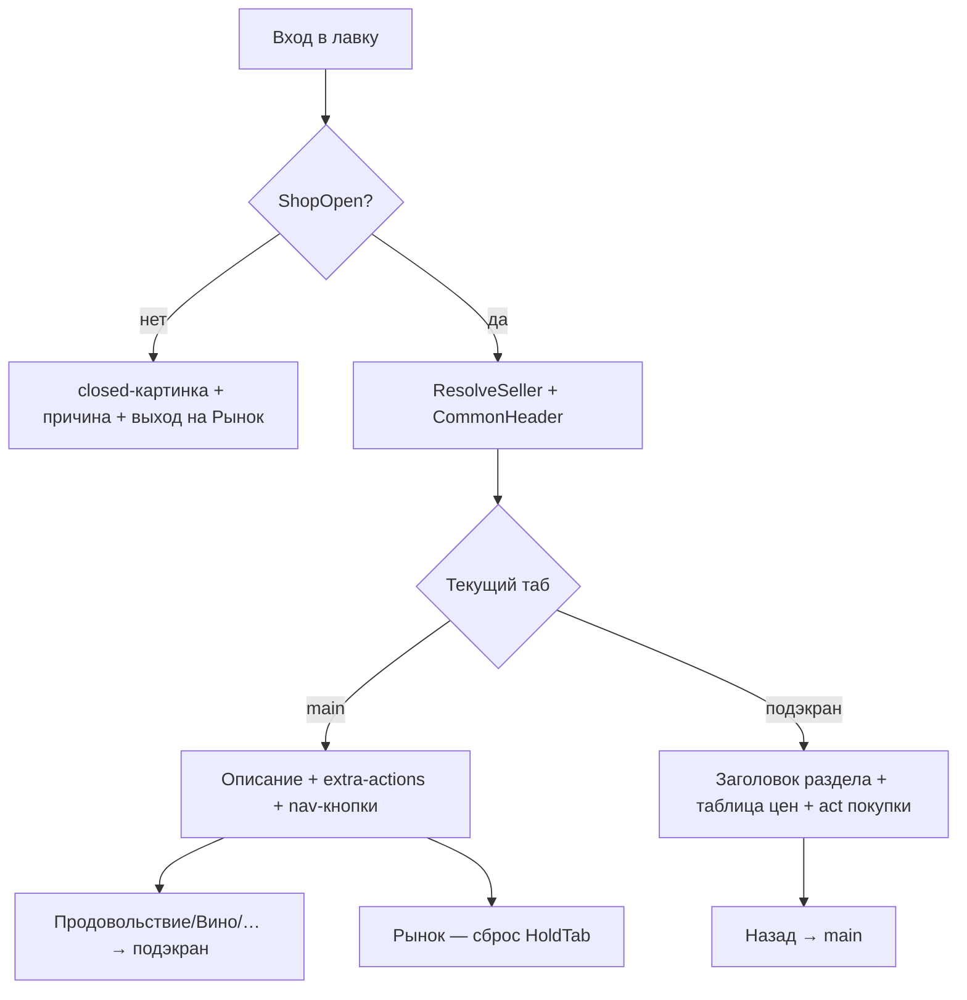
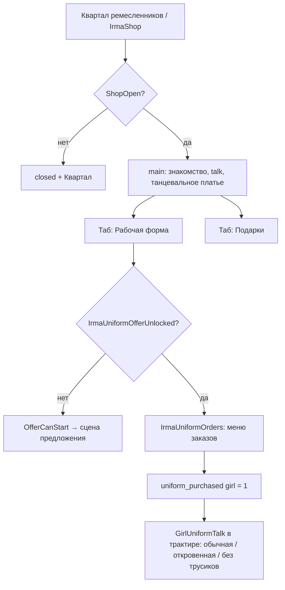
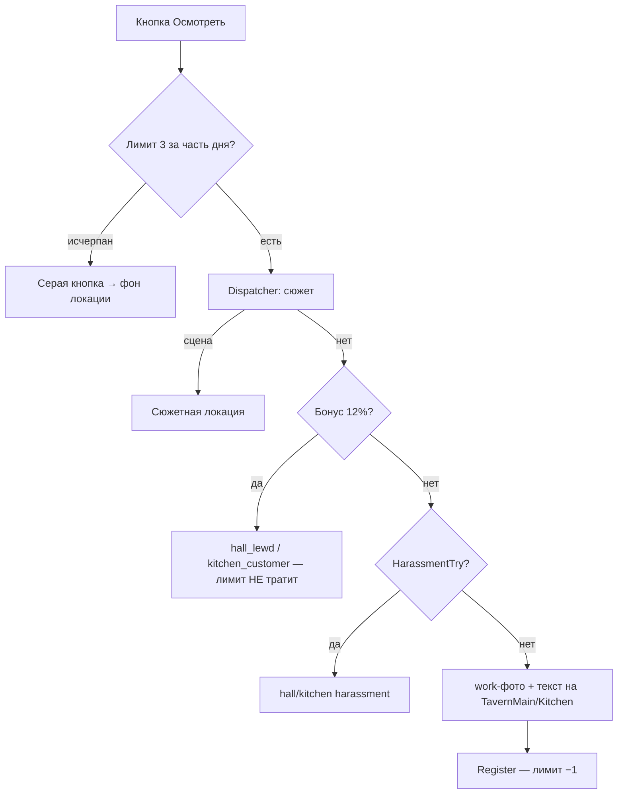
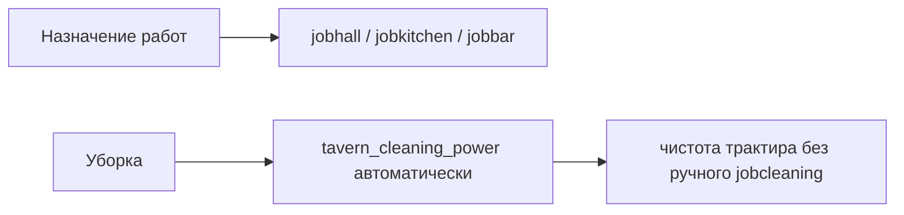
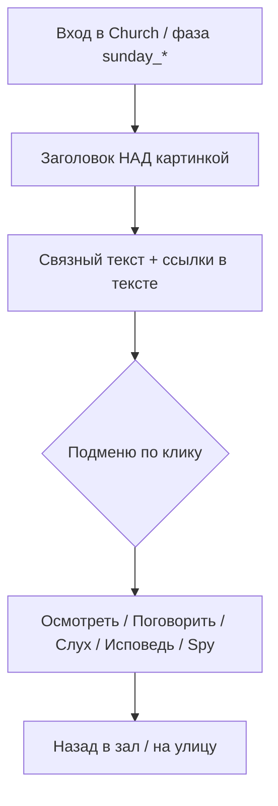
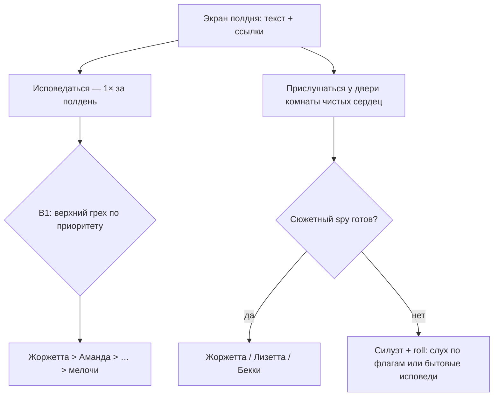
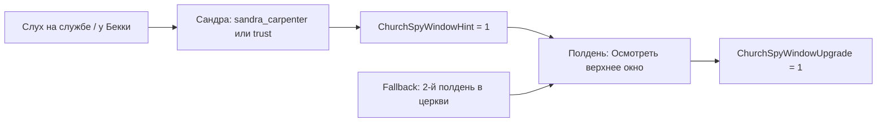

# Схемы взаимодействий и правил

Документ фиксирует **уже реализованные** паттерны UI и **целевые схемы** для систем, которые ещё не доведены до того же уровня. Опирается на `docs/policy-flow.md` и `docs/state.md`.

---

## 1. Общий паттерн лавки на рынке (Becky / Wine / Sweets)

Эталон: `becky_shop.qsps` v10, `wine_shop.qsps` v2, `sweets_shop.qsps` v1.

### 1.1 Структура экрана

### 1.2 Правила

| Правило | Реализация |
|--------|------------|
| Расписание | `time=5` ночь; `week=5, time=4` танцы; `week=7` воскресенье (утро/полдень/день — разные тексты) |
| Табы | `$ShopTab`: `main` / подэкраны; `$ShopHoldTab` сохраняет вкладку после покупки |
| Покупка | Inline через `*ShopBuy*` — сообщение в `$ShopMessage`, `gt Shop, tab` |
| Цены | HTML-таблица на подэкране; подарки — через `GiftRegistryResolve` |
| Продавец | `*ShopResolveSeller` по `time` (и иногда `week`) |
| Talk | Ссылка на NPC через `GirlTalkOpenNpcMenu` / отдельное talk-меню (Эдди) |
| Картинки | `ShowImage`, seller + `shop` + `normal/closed/happy` + вариант |
| Выход | Main: «Рынок»; подэкран: «Назад» + иконка `return.png` |

### 1.3 Расписание продавцов (рынок)

| Лавка | Утро (1) | Полдень (2) | День–вечер (3–4) |
|-------|----------|-------------|------------------|
| Becky | Инга | Эдди | Бекки |
| Wine | Кларисса | Кларисса | Альбер |
| Sweets | без смены (один торговец) | | |

### 1.4 Extra-actions (только main)

Живут на главном табе, не на подэкранах покупки:

- Becky: дети при плохих отношениях, флирт/подсобка Инги, трёшка Бекки+Инга, стук в дом вечером.
- Wine: `ClarissaIntimUnlockTry` (хук интима).

---

## 2. Паттерн лавки портнихи (Ирма)

Эталон: `irma_shop.qsps`, `irma_uniform_offer.qsps`, `irma_uniform_orders.qsps`, `girl_uniform_talk.qsps`.

Отличие от рыночных лавок: **сюжетные ворота** перед коммерцией.

### 2.1 Структура

### 2.2 Ворота откровенной формы (`IrmaUniformOfferCanStart`)

Накопительный счёт `IrmaUniformOfferScore` (порог ≥ 3):

| Источник | Баллы | Флаг-причина |
|----------|-------|--------------|
| `TavernScandal ≥ 25` | +2 | scandal |
| `TavernLewdFame ≥ 10` | +2 | lewd_fame |
| `TavernGirlsEasyRumor` | +2 | rumor |
| `TavernBackroomRumor` | +1 | backroom |
| `TavernKitchenRumor` | +1 | kitchen |
| Пастор / церковь | +3 | pastor |
| `Friends['irma'] ≥ 15` | +2 | trust |

После `IrmaUniformOfferUnlocked = 1` → заказы в `IrmaUniformOrders`.

### 2.3 Цепочка после покупки формы

1. `uniform_purchased[girl] = 1` — можно носить откровенную.
2. `GirlUniformTalk` — игрок назначает уровень: `GirlUniformLevel[girl]` 0 или 1.
3. При `FamilyCorruptionStage ≥ 3` + sluttiness + откровенная форма → опция **без трусиков** (`girl_no_panties_work.qsps`).
4. События зала/кухни читают `GirlNoPantiesWork[girl]` для addon-текстов (не влияет на work-фото осмотра).

### 2.4 Подарки Ирмы

Через `GiftRegistry`: бисер, ткань, нить, брошь (брошь при `Friends['irma'] ≥ 12`).

---

## 3. Осмотр зала и кухни (in-place)

Эталон: `tavern_hall_activity.qsps` v16, `kitchen_activity.qsps` v1, `tavern_main.qsps` v11.

### 3.1 Общая схема

### 3.2 Лимиты

| Зона | Ключ счётчика | Max | Серая кнопка |
|------|---------------|-----|--------------|
| Зал | `TavernHallLookCount[day_time]` | 3 | фон зала (`TavernMainImageModeCode=2`) |
| Кухня | `KitchenLookCount[day_time]` | 3 | фон кухни (`KitchenImageModeCode=2`) |

Счётчики **независимы** (осмотр зала не тратит лимит кухни).

### 3.3 Work-фото

- Зал: `images/events/tavern/work/hall/{normal,reveal}/work_1..8.jpg`
- Кухня: `.../kitchen/.../work_1..4.jpg`
- Выбор: кто на работе + `GirlUniformLevel` → normal/reveal.
- Ночь (`time=5`): work-фото не показывается.

---

## 4. События приставаний и правила работы

См. `docs/policy-flow.md`. Краткая карта:

### 4.1 Hall harassment (Аманда, Мелисса)

| Шаг | Локация |
|-----|---------|
| Try из осмотра зала | `HallHarassmentTry` |
| Сцена | `#HallHarassment` |
| Выбор «мне» | protect_hard / watch / ignore |
| Последствия | `HallHarassmentApplyChoice` |
| Разговор о правилах | `GirlWorkPolicyTalkStart`, area=`hall` |

### 4.2 Kitchen harassment (Сандра)

| Шаг | Локация |
|-----|---------|
| Из зала (шум) | `KitchenHarassmentTryFromHall` ~14% |
| Из осмотра кухни | `KitchenHarassmentTry` ~22% |
| Сцена | `#KitchenHarassment` (общие переменные `$HallHarass*`) |
| Area | `$HallHarassConsequenceArea = 'kitchen'` |
| Разговор | `GirlWorkPolicyTalkStart`, area=`kitchen` |

### 4.3 GirlWorkPolicy (значения)

| Значение | Смысл (зал) |
|----------|-------------|
| 0 | Строгая защита |
| 1 | Умеренная |
| 2 | Терпимость к вниманию |
| 3 | Выгода / внимание важнее |

Отдельно: `GirlKitchenPolicy[girl]` для кухни.

---

## 5. Персонал и работы (текущее / целевое)

### 5.1 Сейчас

- `girl_job.qsps` — назначение: `jobhall`, `jobkitchen`, `jobbar`, `jobcleaning`.
- Панель персонала: роли **автоматически** (`panel_staff_info.qsps` — legacy).
- Макс. 2 работы на девушку; эффективность падает при двойной нагрузке.

### 5.2 Целевая схема (обсуждено, не в коде)

| Правило | Статус |
|---------|--------|
| Убрать `jobcleaning` из меню игрока | TODO |
| `tavern_cleaning_power` от персонала/качества | TODO |
| Осмотр кухни учитывает `jobkitchen` | готово |

---

## 6. Подарки и реестр

Эталон: `gift_registry.qsps`, `gift_shop_menus.qsps`.

| Локация | Подарки | Вход |
|---------|---------|------|
| Becky | herb_bundle, rare_salt | таб gifts |
| Sweets | rare_salt, linen_apron + сладости | таб gifts / sweets |
| Irma | irma_* | таб gifts |
| Draupnir | cutting_board, knife_set | отдельный экран (косметика TODO) |
| Порт / Лизетта | lizette_bracelet | `LizettePortGiftShop` |

Покупка: `GiftShopBuy` → инвентарь `GiftInventory[id]` → вручение через talk/intim.

---

## 7. Чеклист косметики (без нового сюжета)

| Область | Статус | Файлы |
|---------|--------|-------|
| Becky / Wine / Sweets — табы | готово | `*_shop.qsps` |
| Irma — табы main/uniforms/gifts | готово | `irma_shop.qsps` v11 |
| Draupnir — табы + GiftRegistry | TODO | `draupnir`, `gift_shop_menus` |
| GiftShopBuy — единый flash/message | TODO | `gift_registry.qsps` |
| Картинки лавок (normal/closed/talk) | слоты `.gitkeep` | `images/npc/*/shop/` |
| Session handoff | устарел | обновить после косметики |

---

## 8. Порядок работ (рекомендация)

1. **Косметика лавок** — Irma → Draupnir → унификация `GiftShopBuy`.
2. **Схемы без кода** — этот документ; при изменении правил обновлять секции 3–5 и 9.
3. **Церковь + Рипербан** — рефактор UI и spy (секция 9); арка порт–церковь — `docs/design-port-church-arc.md`.
4. **Уборка автоматом** — отдельный PR, без сюжета.
5. **Новые ветки** (no-panties сцены, kitchen harassment тексты) — после косметики.

---

## 9. Церковь + Рипербан (целевая схема)

**Статус:** дизайн согласован, код — заглушки (`church.qsps`, `BuildChurchMenu`).  
**Арка Жоржетта/Лизетта:** `docs/design-port-church-arc.md`.  
**Legacy-тексты:** `docs/legacy-text-extracts/becky_church/`.

### 9.1 Общий UI (как лавка Becky)

| Правило | Решение |
|---------|---------|
| Меню «Действия в церкви» | **Убрать** `BuildChurchMenu` |
| Лор | Ильматер; символ — **святой круг** (не крест); «крестятся» → «очерчивают круг» |
| Улица перед трактиром | В UI: **«Улица Рипербан»** (`#Street`, переименование только в тексте) |
| Комната исповеди | Отдельная локация `#ChurchPureHeartsRoom`; священник и исповедающийся **в одной комнате**, без кабинок |
| Драупнир в соборе | **Не появляется** как NPC |

### 9.2 Воскресенье утро — служба (`sunday_service`, `time = 1`)

Один экран: фото + текст со **ссылками** (паттерн Becky main).

| Ссылка | Лимит | Гейт |
|--------|-------|------|
| Осмотреть | всегда | Герхард, проповедь; ветки пожертвования 30/50 |
| Поговорить | **1×** за службу, потом серая | группы NPC |
| Слух | **1** на группу при флагах | не старые «3 слуха по обходу» |

В тексте службы всегда упоминаются: Герхард, **Родриго Борджиа** (канон; NPC `rodrigo` — TBD), семья, Легаре, Ирма, Бекки; Жоржетта до арки — «кто-то в тени».

Герхард на службе: **только осмотр** (проповедь). Навигация: подменю → **Назад в зал**; с главного → **Улица Рипербан**.

### 9.3 Пожертвования (будни пн–сб, не воскресенье)

| Сумма | rep | Щит на службу |
|-------|-----|---------------|
| 5 / 15 | +1 | — |
| 30 | +2 | не называет трактир/Лонгкоков **вслух** |
| 50 | +2 | **хвалит** трактир |

- Дар в будни → действует на **одно** воскресное утро.
- Ящик на службе и исповеди **нет**.
- Меню Герхарда в будни: пункт «О даре» — **только объяснение**, без кнопок сумм.

### 9.4 Воскресенье полдень — исповедь + spy (`sunday_confession`, `time = 2`)

В **один** полдень доступны **и** исповедь ГГ, **и** подслушивание (не взаимоисключающие).

#### Исповедь ГГ (B1)

- **1 исповедь** за полдень.
- Показывается только **верхний** грех по приоритету (Жоржетта > Аманда > … > мелочи).
- Заглушки **Аманда/Мелисса** (weekly repeatable): секс на неделе → исповедь → spy: картинка NPC+Герхард, признание связи с ГГ.

#### Spy — два уровня (не блокирует арку)

| Уровень | Флаг | Как открывается | Эффект |
|---------|------|-----------------|--------|
| **Базовый** | `ChurchSpyBasicUnlocked = 1` | Авто: первая своя исповедь **или** сюжетный гейт spy (E/G) | Ссылка «Прислушаться…»; текст + силуэт; **сюжетные сцены всегда идут** |
| **Улучшенный угол** | `ChurchSpyWindowUpgrade = 1` | Опциональная цепочка (ниже) | Полный диалог, лучше картинка, иногда +1 слух |

**Арка Жоржетта/Лизетта не требует** `ChurchSpyWindowUpgrade`.

#### Опциональная цепочка «механизм у окна» (бонус, не hard gate)

| Источник hint | Содержание |
|---------------|------------|
| Слух на службе | Драупнир чинил комнату чистых сердец, поставил шестерёнку — сам до неё не дотягивается |
| Сандра, личный talk | Пересказ того же с юмором (`sandra_carpenter` или `SandraTrust` ≥ порога) |
| Fallback | После **2-го** полдня в церкви ГГ замечает потёртую стену у высокого окна |

Драупнир в мастерской (будни, необязательно): при `ChurchSpyWindowHint = 1` — короткая реплика «делал для роста гнома».

#### Пропуск spy по сюжету

| Тип | Поведение |
|-----|-----------|
| Заглушки (Аманда/Мелисса) | Без штрафа; повтор на след. неделе |
| Сюжет (Жоржетта) | Арка **ждёт**; `GeorgettePriestSpySeen` только после spy; повтор при следующей исповеди о Жоржетте |
| Сюжет (Лизетта) | Два акта = **две недели** полдня (см. 9.5) |

### 9.5 Арка: Жоржетта и Лизетта в полдень

Согласовано с `design-port-church-arc` — тот же слот, что port-church arc.

| NPC | Недели | Полдень |
|-----|--------|---------|
| **Жоржетта** | 1 | После исповеди ГГ (`GeorgetteConfessBasic`) → spy E: жрец + Жоржетта → `GeorgettePriestSpySeen` |
| **Лизетта** | **2** | Spy в два акта (после `GeorgetteConfessLizaSaw`, `LizaSawSexInChurch`) |

#### Лизетта — акт 1 (`LizettePriestSpyStage = 1`)

**Комната чистых сердец.** Legacy: `churchlizaadmit` / `IntLizettAfterCermon`.

| Блок | Жрец спрашивает | Лизетта |
|------|-----------------|---------|
| A | Видела ли мать и ГГ в церкви? | Смущение, детали |
| B | Хотела бы сама? | Высокий `otkroven` — ведёт |
| C | Делала ли уже? | Признание или уход |

**Потолок:** жрец **только обнимает и успокаивает** — без секса. `LizettePriestSpySeen` **ещё нет**.

#### Лизетта — акт 2 (`LizettePriestSpyStage = 2`)

**+1 воскресенье** после акта 1. Продолжение → секс Лизетта + Герхард → `LizettePriestSpySeen = 1`, `LizetteSexUnlocked = 1`.

Ночью в порту (зеркало E): акт 1 — «дочь расплакалась»; акт 2 — «пусть идёт работать со мной» → `LizetteProstPort`.

`LizetteSexUnlocked` **не** на F3 — только после акта 2.

### 9.6 Файлы (план)

| Модуль | Назначение |
|--------|------------|
| `church.qsps` | Роутинг по фазе; убрать старое меню |
| `church_sunday_service.qsps` | Утро: текст + ссылки |
| `church_confession_dynamic.qsps` | Полдень: исповедь B1 |
| `church_spy_georgette.qsps` | Spy E |
| `church_spy_lizette.qsps` | Spy G1/G2 (два акта) |
| `church_spy_becky.qsps` | Ongoing Бекки (параллельно) |
| `#ChurchPureHeartsRoom` | Комната исповеди (новая локация) |
| `street.qsps` | UI: «Улица Рипербан» |

---

## Связанные файлы

| Система | Модули |
|---------|--------|
| Рынок | `market.qsps`, `becky_shop*`, `wine_shop*`, `sweets_shop*` |
| Ирма | `irma_shop.qsps`, `irma_uniform_offer*`, `irma_uniform_orders*`, `girl_uniform_talk*` |
| Трактир | `tavern_hall_activity.qsps`, `kitchen_activity.qsps`, `tavern_main.qsps`, `kitchen.qsps` |
| Церковь | `church.qsps`, `church_menus.qsps`, `church_sunday_service*`, `church_spy_*`, `church_confession_*` |
| События | `hall_harassment.qsps`, `kitchen_harassment.qsps`, `girl_work_policy_talk.qsps` |
| Policy | `policy_event_context.qsps`, `docs/policy-flow.md` |
| Арка порт–церковь | `docs/design-port-church-arc.md` |