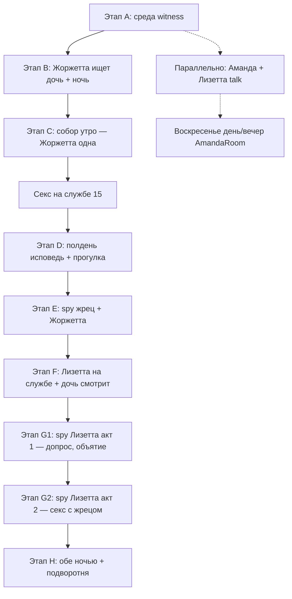

# Арка «Порт → Жоржетта → Церковь → Подворотня»

**Статус:** дизайн согласован, реализация по этапам.  
**Источник legacy:** `Traktir.qsps` — `#PortStreets`, `#Church`, `#ChurchIspoved`, `#ChurchAfterCermon`, `#IntGeorgettTalk`, `StreetClients`.  
**Связанные документы:** `docs/import-traktir-legacy.md` (общий импорт), `docs/design-mayor-seal-corruption-arc.md` (мэр, костюм, слухи), `docs/design-interaction-schemes.md` §9 (UI церкви, spy, Рипербан).

---

## Глобальные правила (не обсуждаются)

| Правило | Решение |
|---------|---------|
| Беременность | **Нет** нигде — механика не переносится, тексты legacy про «залетела» вырезать |
| Трактир-проституция | **Не в v1** — задел на позднюю игру; glory hole **не** возвращать |
| Witness у корабля | Без присутствия ГГ у причала в среду знакомства Аманды и Лизетты **нет** |
| Intim Лизетты с ГГ | Только **церковская цепочка** (`LizetteSexUnlocked`); платный «снять» в порту — после `LizetteProstPort` |
| Цены | Порт «снять» **10** мараведи; секс на службе **15** мараведи |
| Исповедь | Слот **полдень** воскресенья (`time = 2`, `sunday_confession`); в **один** полдень можно **и** исповедаться, **и** подслушать/spy |
| Spy unlock | **Базовый** spy — авто (не блокирует арку); **улучшенный угол** (`ChurchSpyWindowUpgrade`) — опционально через слух/Sandra/окно (см. §9 `design-interaction-schemes`) |
| Лизетта spy | **Два акта** = **две недели** полдня; `LizetteSexUnlocked` только после акта 2 |
| Подворотня | Рандомные клиенты + **Легаре/Эдди без** гейта `AmandaLegare` |
| `qsp-project.json` | **Не менять** без явной просьбы |

---

## Карта арки (сводная)



**Счётчик недель:** `PortChurchArcWeek` (+1 каждое воскресенье после `PortMeetWitnessed`) **или** отдельные флаги «доступно с N-го воскресенья после события X». При реализации выбрать один подход и не смешивать.

---

## NPC — базовые статы (уже в коде)

| NPC | Файл | Возраст | `sluttiness` | `otkroven` | `Friends` |
|-----|------|---------|--------------|------------|-----------|
| Лизетта | `modules/npc/port/lizette.qsps` | 18 | 24 | **16** (выше Аманды) | 12 |
| Жоржетта | `modules/npc/port/georgett.qsps` | 32 | 68 | 22 | 12 |

У Лизетты `otkroven` выше с старта — в диалогах она **ведёт** и раньше переходит к откровенным темам.

---

## Расписание и слоты

| Фаза | `week` / `time` | `$CitySchedulePhase` |
|------|-----------------|----------------------|
| Столичный корабль | `week = CapitalShipWeekDay` (3), `time 1–3` | обычный рабочий день |
| Воскресная служба | `week = 7`, `time = 1` | `sunday_service` |
| Исповедь | `week = 7`, `time = 2` | `sunday_confession` |
| Визиты | `week = 7`, `time 3–4` | `sunday_visits` |
| Ночь порта | `time = 5`, `Port` | `night` |

**Лизетта в порту (фон, этап 0):** `$GirlLocation['lizette'] = 'Port'` в день корабля, пока `PortMeetWitnessed = 0`, **без** `LizetteKnown`.

**Жоржетта днём в порту:** только после этапа B (`GeorgetteSeekLizetteDone = 1`). До этого кнопок talk с Жоржеттой в `Port` **нет**.

**Аманда в порт:** каждую среду корабля, пока `PortMeetWitnessed = 0` → `$GirlLocation['amanda'] = 'Port'`, `AmandaAtPortShip = 1`.

---

## Этап 0 — Лизетта в порту неявно

| Параметр | Значение |
|----------|----------|
| Условие | День корабля, `PortMeetWitnessed = 0` |
| Эффект | Лизетта физически в порту (расписание), игрок **не знает** имя |
| Флаги | `LizetteKnown = 0`, `AmandaMetLizette = 0` |
| Код | `npc_city_schedule.qsps` — ветка до witness |

---

## Этап A — Среда, корабль, witness (✅ реализовано v1)

### Шаги

| ID | Условие | Сцена / эффект |
|----|---------|----------------|
| A1 | Корабль, `time 1–3`, `PortMeetWitnessed = 0` | Аманды **нет в зале** |
| A2 | ГГ в трактире, та же среда | Talk **Мелисса/Сандра** (1×/день на девушку): мама отпустила в порт; Мелисса: «она молодая, а я уже нет» |
| A3 | ГГ у корабля (`PortCapitalShipMenu`) | Аманда + незнакомка у товара; **заметное** появление Лизетты |
| A4 | Кнопка «Наблюдать, не вмешиваясь» | `PortMeetWitnessed = 1`, `AmandaMetLizette = 1`, `LizetteKnown = 1`, `LizetteVisitStage = 1`; статы: `AmandaLizaInfluence +2`, `AmandaPublicAttention +1`, `AmandaSecretiveness +1` |
| A5 | ГГ **не** был у корабля в эту среду | Флаги **не** ставятся; **следующая среда** — повтор A1–A3 |
| A6 | `PortMeetWitnessed = 1` | Аманда снова в зале; цикл пропажи **закончен** |

### Важно

- Гейт `LizetteMentionedByGeorgette` **убран** — знакомство не требует talk с матерью.
- Кнопки calm / warn / ban **убраны** — только witness.
- «Отойти» из сцены **не** ставит флаги.

### Файлы (готово)

| Файл | Назначение |
|------|------------|
| `modules/events/tavern/amanda_port_ship_hint.qsps` | Хук talk Мелиссы/Сандры |
| `modules/events/tavern/amanda_port_ship_hint_text.qsps` | Тексты |
| `modules/events/port/port_amanda_lizette.qsps` | Witness-only сцена |
| `modules/events/port/port_amanda_lizette_text.qsps` | Тексты |
| `modules/events/port/port_capital_ship.qsps` | Кнопка «Заметить Аманду» |
| `modules/core/time/npc_city_schedule.qsps` | Аманда/Лизетта в порт |
| `modules/core/time/business_schedule.qsps` | Init-флаги |
| `modules/actions/dialogs/girl_talk_tavern.qsps` | Хук port_ship |
| `modules/locations/town/port.qsps` | Жоржетта убрана до этапа B |

---

## Этап B — Жоржетта: днём ищет дочь → ночь в порту

### Триггер

| Шаг | Условие | Действие |
|-----|---------|----------|
| B0 | `PortMeetWitnessed = 1` | При `next_day` один раз: `GeorgetteSeekDelayDays = Rand(2, 5)`, `GeorgetteSeekScheduled = 1` |
| B1 | `day >= GeorgetteSeekStartDay` (или счётчик дней), днём, `GeorgetteSeekLizetteDone = 0` | **Разовый** ивент в `Port`: Жоржетта ищет дочь |
| B2 | Talk | `GeorgetteKnown = 1`, `GeorgetteSeekLizetteDone = 1`; знакомство; **приглашение заходить ночью** |
| B3 | `time = 5`, `Port`, `GeorgetteKnown = 1` | Меню: smalltalk / подглядеть / **«снять» 10** → секс |

### После первого платного секса

- `GeorgettePortSexDone = 1`
- `HadSex['georgett'] += 1` (через новую sex-систему)

### Talk ночью (без оплаты) — темы из legacy `#IntGeorgettTalk`

Очередь по `otkroven['georgett']` / `Friends['georgett']` (черновик):

| Тема | Гейт | Содержание |
|------|------|------------|
| Биография | старт | Порт, дети, как пришла к этому |
| Клиенты | `Friends >= 14` | Кто ходит, моряки, ремесленники |
| Лизетта | после witness | Дочь, тревога, «не слушает мать» |
| Церковь | `GeorgettePortSexDone = 1` | Отец Герхард, исповедь, лицемерие |
| Эдди | `Friends >= 18` | Мальчишка из лавки Бекки (задел к ветке Бекки) |

**Убрать из legacy:** прайс трактира, glory hole, приглашение в зал.

### Файлы (план)

| Файл | Назначение |
|------|------------|
| `modules/events/georgette/georgette_seek_lizette.qsps` | Дневной разовый ивент B1–B2 |
| `modules/events/georgette/georgette_seek_lizette_text.qsps` | Тексты поиска дочери |
| `modules/events/georgette/georgette_port_night.qsps` | Ночное меню B3 |
| `modules/events/georgette/georgette_port_night_text.qsps` | Talk, подглядеть, снять |
| `modules/locations/town/port.qsps` | Вернуть кнопки Жоржетты после B2 |
| `modules/core/time/next_day.qsps` | Планирование `GeorgetteSeekDelayDays` |

### Хуки в `next_day`

```
if PortMeetWitnessed = 1 and GeorgetteSeekScheduled = 0:
    GeorgetteSeekDelayDays = Rand(2, 5)
    GeorgetteSeekStartDay = day + GeorgetteSeekDelayDays
    GeorgetteSeekScheduled = 1
end
```

При входе в `Port` днём: если `day >= GeorgetteSeekStartDay` и флаги — `gt GeorgetteSeekLizetteEvent`.

---

## Этап C — Церковь: Жоржетта одна на службе

| Шаг | Условие | Сцена |
|-----|---------|--------|
| C1 | **Следующее воскресенье** после `GeorgettePortSexDone` | Утро: в меню прихожан **только Жоржетта** (`GeorgetteChurchAlone = 1`); **Лизетты нет** |
| C2 | `Friends['georgett'] >= 20` (черновик), `HadSex['georgett'] >= 1` (смягчить legacy `>= 3`) | На службе: предложение секса в углу собора — **15** мараведи |
| C3 | Согласие + оплата | `GeorgetteFuckInChurch = 1`, `HadSex['georgett']++`, риск скандала (задел `TavernScandal` / слух) |

**Меню прихожан** (утро, girl-talk стиль, без кнопки «Закрыть»):

- Семья (мама + сёстры) — поболтать
- Легаре + Кларисса — поболтать (пара)
- Бекки + дети — поболтать
- **Жоржетта** — поболтать (после C1; без Лизетты)
- Мэр — только осмотр
- Ирма — только осмотр (тень колонны)
- Обход собора — слухи (до 3 попыток, `ChurchRumorAttempts_Service[day]`)

### Файлы (план)

| Файл | Назначение |
|------|------------|
| `modules/events/church/church_sunday_service.qsps` | Меню прихожан |
| `modules/events/church/church_sunday_service_text.qsps` | Тексты групп |
| `modules/events/church/church_georgette_service_sex.qsps` | C2–C3, цена 15 |
| `modules/locations/town/church.qsps` | Заменить заглушку: роутинг по фазе |

---

## Этап D — Полдень: исповедь + прогулка

| Шаг | Условие | Сцена |
|-----|---------|--------|
| D1 | **+1 воскресенье** после C (или после `GeorgetteFuckInChurch`) | Слот `sunday_confession` активен для арки |
| D2 | Один полдень | Меню: **Исповедаться** И **Прогуляться у церкви** — оба доступны, не взаимоисключающие в рамках слота |
| D3 | Исповедь | Динамическое меню по `HadSex[*]` и флагам арки |
| D4 | Прогулка | Если нет spy-гейта — осмотр церкви; иначе — spy (E, G) |
| D5 | Задел | `PriestConfessionCorruption` — не в v1, только инкремент |

### Меню исповеди (черновик `#ChurchIspoved`)

Показывать пункты по условиям:

| Пункт | Условие | Флаг |
|-------|---------|------|
| Грех с Жоржеттой (общий) | `HadSex['georgett'] >= 1` | `GeorgetteConfessBasic = 1` |
| На службе в соборе | `GeorgetteFuckInChurch = 1` | `GeorgetteConfessInChurch = 1` |
| На глазах у дочери | `LizaSawSexInChurch = 1` | `GeorgetteConfessLizaSaw = 1` |
| Другие девушки | `HadSex[girl] >= 1` | счётчик / задел corruption |
| Общая исповедь без деталей | всегда | без флага арки |

После каждой откровенной исповеди: `PriestConfessionCorruption += 1` (задел).

### Файлы (план)

| Файл | Назначение |
|------|------------|
| `modules/events/church/church_confession_dynamic.qsps` | D3 меню |
| `modules/events/church/church_confession_dynamic_text.qsps` | Тексты грехов |
| `modules/events/church/church_after_sermon.qsps` | D4 прогулка (legacy `ChurchAfterCermon`) |

---

## Этап E — Spy: священник + Жоржетта

| Шаг | Условие | Сцена |
|-----|---------|--------|
| E1 | **+1 воскресенье** после D, `GeorgetteConfessBasic = 1` | Полдень: подслушать → **Жоржетта + отец Герхард** (Комната чистых сердец) |
| E2 | Ночь, порт, talk Жоржетта | «Ты на исповеди всё рассказал — с меня не убудет» |
| E3 | — | `GeorgettePriestSpySeen = 1` |

Пропуск → арка **ждёт**; повтор при следующей исповеди о Жоржетте. Базовый spy доступен без квеста на механизм окна.

### Файлы (план)

`modules/events/church/church_spy_georgette.qsps`, `church_spy_georgette_text.qsps`

---

## Этап F — Лизетта на службе, дочь смотрит

| Шаг | Условие | Сцена |
|-----|---------|--------|
| F1 | **+1 воскресенье** после E | Утро: **Лизетта с Жоржеттой** в меню прихожан (отдельная группа, не с Амандой) |
| F2 | Повторный секс с Жоржеттой на службе (C2) | Лизетта **смотрит** / ласкает себя → `LizaSawSexInChurch = 1` |
| F3 | **+1 воскресенье**, исповедь | Пункт «трахал Жоржетту на глазах у дочери» → `GeorgetteConfessLizaSaw = 1` |

**Секс ГГ с Лизеттой (intim):** гейт `LizetteSexUnlocked` — **после G2**, не на F3.

### Файлы (план)

Дополнение `church_sunday_service.qsps`, `church_georgette_service_sex.qsps` (ветка «дочь смотрит»).

---

## Этап G — Spy: священник + Лизетта (два акта, две недели)

Локация: **Комната чистых сердец** (`#ChurchPureHeartsRoom`). Legacy: `churchlizaadmit`, `IntLizettAfterCermon`.

### G1 — Акт 1 (неделя 1)

| Шаг | Условие | Сцена |
|-----|---------|--------|
| G1a | **+1 воскресенье** после F3, `GeorgetteConfessLizaSaw = 1`, `LizaSawSexInChurch = 1` | Полдень: spy **Лизетта + отец Герхард** |
| G1b | Содержание | Жрец выспрашивает: видела ли мать и ГГ в церкви; хотела бы сама; делала ли |
| G1c | Потолок | Жрец **только обнимает и успокаивает** — без секса |
| G1d | Ночь, порт, talk Жоржетта | «Дочь на исповеди расплакалась — с меня не убудет» (зеркало E) |
| G1e | Флаги | `LizettePriestSpyStage = 1`; `LizettePriestSpySeen` **ещё 0** |

Пропуск полдня → повтор на **следующем** воскресенье с готовым гейтом G1.

### G2 — Акт 2 (неделя 2)

| Шаг | Условие | Сцена |
|-----|---------|--------|
| G2a | **+1 воскресенье** после G1, `LizettePriestSpyStage = 1` | Полдень: spy — продолжение → секс Лизетта + Герхард |
| G2b | Ночь, порт, talk Жоржетта | «Девочка созрела, пусть идёт работать со мной» → `LizetteProstPort = 1` |
| G2c | Флаги | `LizettePriestSpyStage = 2`, `LizettePriestSpySeen = 1`, `LizetteSexUnlocked = 1` |

### Файлы (план)

`modules/events/church/church_spy_lizette.qsps`, `church_spy_lizette_text.qsps` (ветки `stage=1` / `stage=2`)

---

## Этап H — Обе ночью в порту, подворотня

| Шаг | Условие | Сцена |
|-----|---------|--------|
| H1 | `LizetteProstPort = 1`, `time = 5`, `Port` | Жоржетта **и** Лизетта; выбор **одной** → «снять» **10** / секс |
| H2 | Нет выбранной на причале | **Подворотня** `port_alley_spy` — клиент + Жоржетта или Лизетта |
| H3 | Задел | Приглашение в трактир (legacy) — **поздняя игра**, не v1 |

### Таблица клиентов подворотни (v1 — текст, без спрайта)

| ID | Вес `Rand` | Описание |
|----|------------|----------|
| `old_man` | 25 | Старик-ремесленник |
| `sailors` | 25 | Двое матросов |
| `townsman` | 20 | Горожанин средних лет |
| `young_man` | 20 | Молодой парень |
| `priest` | 5 | Священник (редко) |
| `legare` | 5 | Легаре — **без** гейта AmandaLegare |
| `eddie` | 5 | Эдди из лавки Бекки |

Эффекты: текст сцены; опционально `TavernScandal += 1`, слух в обходе церкви.

### Файлы (план)

| Файл | Назначение |
|------|------------|
| `modules/events/port/port_alley_spy.qsps` | H2, таблица клиентов |
| `modules/events/port/port_alley_spy_text.qsps` | Тексты по клиентам |
| `modules/events/georgette/georgette_port_night.qsps` | H1 — обе на причале |
| `modules/locations/town/port_alley.qsps` или хук в `Port` | Вход в подворотню |

---

## Параллельная ветка: Аманда + Лизетта

### Где бывает

| Место | Когда | Условие |
|-------|-------|---------|
| Трактир / 2-й этаж | После `LizetteKnown` | Подслушивание (legacy) |
| `AmandaRoom` | Воскресенье **день/вечер** (`sunday_visits`) | `AmandaMetLizette = 1` |
| Собор утром | — | **Нет** совместного talk; Аманда в семейной группе |

### Откровенность тем

| Кто | Правило |
|-----|---------|
| **Аманда** | Уровень фраз ∝ `sluttiness['amanda']` |
| **Лизетта** | Выше по умолчанию (`otkroven = 16`); ведёт диалог |

Черновик гейтов фраз (из `#InitAmandaLizaTalkItems`):

| `sluttiness['amanda']` | Темы |
|------------------------|------|
| низкая, после порта | Наивные вопросы (дети, анатомия) |
| ~15+ | «Ты со Стефаном…?», первый раз |
| после harassment | Запреты ГГ (Легаре, мальчики, Лизетта) |
| параллель Legare | Внимание Легаре |
| высокий `AmandaLizaInfluence` | «Хочу быть как ты» |

### Подслушивание

1. ГГ подслушал → единственная реакция: **уйти**.
2. **Запрет встреч** с Лизеттой — **отдельная сцена позже** (`AmandaLizetteMeetingsBanned` / policy мэра), не в тот же клик.

### Убрать из legacy

Glory hole; беременность; «мамка дядям отсасывает».

### Файлы (план)

| Файл | Статус |
|------|--------|
| `modules/npc/amanda/amanda_lizette.qsps` | есть, **обновить** гейты (не HallEvent до witness) |
| `modules/npc/amanda/amanda_lizette_text.qsps` | есть |
| `modules/npc/amanda/amanda_lizette_phrases.qsps` | **создать** — очередь фраз |
| `modules/locations/rooms/amanda_room.qsps` | кнопка воскресного talk |
| `modules/events/amanda/amanda_events.qsps` | хуки подслушивания |

**Важно:** `amanda_lizette.qsps` сейчас может стартовать `first_talk` через `HallEventDiscussed` **до** witness — при реализации ветки **привязать** к `PortMeetWitnessed = 1`.

---

## Реестр флагов арки

### Порт / witness

| Флаг | Init | Смысл |
|------|------|-------|
| `PortMeetWitnessed` | 0 | ГГ видел знакомство у корабля |
| `AmandaAtPortShip` | 0 | Runtime: Аманда в порт в среду |
| `AmandaMetLizette` | 0 | Аманда познакомилась с Лизеттой |
| `LizetteKnown` | 0 | ГГ знает Лизетту |
| `LizetteVisitStage` | 0 | Стадия визитов (1 после witness) |
| `$LizetteSourceKnown` | — | `'port_amanda'` |
| `LizetteBanned` | 0 | Legacy от ban-кнопки; в witness-only не ставится |
| `CapitalShipWeekDay` | 3 | День недели корабля |

### Жоржетта

| Флаг | Init | Смысл |
|------|------|-------|
| `GeorgetteKnown` | 0 | Знакомство с ГГ |
| `GeorgetteSeekScheduled` | 0 | Задержка B запланирована |
| `GeorgetteSeekDelayDays` | 0 | Rand(2,5) |
| `GeorgetteSeekStartDay` | 0 | День ивента B1 |
| `GeorgetteSeekLizetteDone` | 0 | Дневной ивент прошёл |
| `GeorgettePortSexDone` | 0 | Первый платный секс в порту |
| `LizetteMentionedByGeorgette` | 0 | Legacy; **не** гейт для witness |

### Церковь

| Флаг | Init | Смысл |
|------|------|-------|
| `GeorgetteChurchAlone` | 0 | C1: одна на службе |
| `GeorgetteFuckInChurch` | 0 | Секс на службе был |
| `GeorgetteConfessBasic` | 0 | Исповедь: Жоржетта |
| `GeorgetteConfessInChurch` | 0 | Исповедь: в соборе |
| `GeorgetteConfessLizaSaw` | 0 | Исповедь: на глазах у дочери |
| `LizaSawSexInChurch` | 0 | Лизетта видела секс на службе |
| `GeorgettePriestSpySeen` | 0 | E1 spy |
| `LizettePriestSpyStage` | 0 | G: 0 нет, 1 акт 1 (допрос), 2 акт 2 (секс) |
| `LizettePriestSpySeen` | 0 | G2 завершён |
| `ChurchSpyBasicUnlocked` | 0 | Базовое подслушивание (авто, не блокирует арку) |
| `ChurchSpyWindowHint` | 0 | Слух/Sandra/fallback про механизм у окна |
| `ChurchSpyWindowUpgrade` | 0 | Улучшенный угол обзора (бонус) |
| `PriestConfessionCorruption` | 0 | Задел |
| `PortChurchArcWeek` | 0 | Опциональный счётчик недель |

### Лизетта / порт (поздно)

| Флаг | Init | Смысл |
|------|------|-------|
| `LizetteSexUnlocked` | 0 | Intim с ГГ в церкви |
| `LizetteProstPort` | 0 | Платный «снять» в порту |
| `AmandaLizetteMeetingsBanned` | 0 | Запрет встреч (позже) |

### Talk-хуки (этап A)

| Массив | Смысл |
|--------|-------|
| `AmandaPortShipHintDiscussed[girl_day]` | Мелисса/Сандра уже говорили |

---

## Экономика и sex-система

| Услуга | Цена | Условие |
|--------|------|---------|
| Жоржетта, ночь «снять» | 10 | B3, H1 |
| Лизетта, ночь «снять» | 10 | После `LizetteProstPort` |
| Жоржетта, секс на службе | 15 | C2, F2 |

- Оплата до сцены; при нехватке денег — отказ.
- `RegisterPlayerCum` / `max_daily_cum` — по общим правилам проекта.
- Беременность **не** вызывать.

---

## Порядок реализации (PR-очередь)

| # | Этап | Файлы | Статус |
|---|------|-------|--------|
| 1 | **A** | port witness, hint, schedule | ✅ v1 |
| 2 | **B** | georgette_seek, georgette_port_night, port.qsps, next_day | ✅ v1 |
| 3 | **C** | church_sunday_service, georgette_service_sex, church.qsps | ✅ v1 |
| 4 | **D** | church_confession_dynamic, church_after_sermon | ✅ v1 |
| 5 | **E** | church_spy_georgette | ✅ v1 |
| 6 | **F** | Лизетта на службе, LizaSaw, GeorgetteConfessLizaSaw | ✅ v1 |
| 7 | **G1–G2** | church_spy_lizette (2 акта), LizetteSexUnlocked, LizetteProstPort | ✅ v1 (`LizetteProstPort` после G2) |
| 8 | **H** | port_prost_night, port_alley_spy | ✅ v1 |
| 9 | **Параллель** | amanda_lizette_phrases, AmandaRoom воскресенье | ⬜ |

После каждого PR — отметка `[x]` в `import-traktir-legacy.md` и здесь.

---

## Воскресная церковь — полная спецификация (хаб)

Слот `sunday_service` — **полгорода внутри**.

### Утро: меню прихожан

| Группа | Действие | Гейт |
|--------|----------|------|
| Мама + сёстры | Поболтать | всегда |
| Легаре + Кларисса | Поболтать (пара) | всегда |
| Бекки + дети | Поболтать | всегда |
| Жоржетта (+ Лизетта с F1) | Поболтать | `GeorgetteChurchAlone` / после F1 |
| Мэр | Только осмотр | всегда |
| Ирма | Только осмотр (тень) | всегда |
| Пройтись / прислушаться | Слухи | до 3×, `ChurchRumorAttempts_Service[day]` |

**Нет в соборе:** гном/Драупнир как NPC; Аманда+Лизетта **вместе**.

### Полдень

Исповедь + подслушивание (этапы D–G). UI: текст + ссылки (без `BuildChurchMenu`). Подробности — `design-interaction-schemes.md` §9.

| Элемент | Правило |
|---------|---------|
| Исповедь ГГ | 1× за полдень; B1 — верхний грех по приоритету |
| Spy сюжетный | Жоржетта (E), Лизетта (G1→G2), Бекки (ongoing) — **тот же полдень** |
| Spy без NPC | Силуэт + roll (слухи или бытовые исповеди) |
| Spy unlock | Базовый — авто; улучшенный угол — опционально (Драупнир/окно) |

### День / вечер

- Семейные визиты (`SundayVisitBeckySandra`, `SundayVisitClarissaMelissa`)
- **Аманда + Лизетта** в `AmandaRoom` при `AmandaMetLizette`
- Лавочные визиты — дополнение (`sunday_shop_visits`)

---

## Legacy → новая игра (mapping)

| Legacy | Новое | Действие |
|--------|-------|----------|
| Знакомство у корабля после talk Жоржетты | Witness без Жоржетты | ✅ |
| 4 кнопки вмешательства ГГ | Только наблюдение | ✅ |
| `time=1` исповедь | `time=2` полдень | План |
| Трактир-проституция | Порт / подворотня | План |
| `lizasawinchurch` | `LizaSawSexInChurch` | План |
| `ProstStart` | `LizetteProstPort` | План |
| Беременность | — | Убрать |

---

## Открытые вопросы (мелкие, не блокируют код)

1. Точный гейт C2: `HadSex['georgett'] >= 3` (legacy) vs `>= 1` — при реализации взять **>= 1** + `Friends >= 20`.
2. Веса клиентов подворотни — таблица выше, можно подкрутить при плейтесте.
3. `PriestConfessionCorruption` — только инкремент в v1, без эффекта на NPC.
4. Тексты 2 лор-историй за визит к Древу — отдельная ветка (Ирма), не эта арка.
5. Порог `SandraTrust` для hint про окно — при реализации (черновик: `GirlTrustStefan['sandra'] >= 15` или `GirlPersonalStoryUnlock['sandra_carpenter'] = 1`).

**Закрыто:** глобальные правила; этапы A–H; UI церкви и spy (§9 `design-interaction-schemes`); Лизетта 2 акта; spy unlock без hard gate.

---

## Чеклист файлов (сводный)

### Готово

- [x] `modules/events/tavern/amanda_port_ship_hint.qsps`
- [x] `modules/events/tavern/amanda_port_ship_hint_text.qsps`
- [x] `modules/events/port/port_amanda_lizette.qsps`
- [x] `modules/events/port/port_amanda_lizette_text.qsps`
- [x] `modules/events/port/port_capital_ship.qsps` (кнопка witness)
- [x] `modules/core/time/npc_city_schedule.qsps` (фрагмент)
- [x] `modules/core/time/business_schedule.qsps` (init-флаги)
- [x] `modules/locations/town/port.qsps` (Жоржетта убрана до B)

### Очередь (оставшееся / полировка)

- [ ] `images/locations/church/window/ajar.png` — арт окна (бриф `ASSET-ajar.txt`)
- [ ] `ChurchSundayQuiet` — воскресенье день/вечер: визиты NPC (не только рынок)
- [ ] Исповедь Аманды/Мелиссы — полные ветки вместо `amanda_stub` / `melissa_stub`
- [ ] Talk Жоржетты ночью после E/G — зеркальные реплики из дизайна (опционально)
- [ ] `amanda_lizette_phrases` — параллельная ветка

### Реализовано (сводка 2026-06)

- [x] `modules/events/georgette/georgette_seek_lizette.qsps`
- [x] `modules/events/georgette/georgette_seek_lizette_text.qsps`
- [x] `modules/events/georgette/georgette_port_night.qsps`
- [x] `modules/events/georgette/georgette_port_night_text.qsps`
- [x] `modules/events/church/church_sunday_service*.qsps`
- [x] `modules/events/church/church_sunday_rumors.qsps` (тексты в `church_sunday_service_text`)
- [x] `modules/events/church/church_georgette_service_sex.qsps`
- [x] `modules/events/church/church_confession_dynamic*.qsps`
- [x] `modules/events/church/church_after_sermon.qsps`
- [x] `modules/events/church/church_spy_georgette*.qsps`
- [x] `modules/events/church/church_spy_lizette*.qsps`
- [x] `modules/events/church/church_spy_becky*.qsps`
- [x] `modules/events/port/port_prost_night*.qsps`, `port_alley_spy*.qsps`
- [x] `modules/locations/town/church.qsps`, `church_pure_hearts_room.qsps`
- [x] Init-флаги в `business_schedule.qsps`

---

## Чеклист плотного теста A–H

Инструмент: **Дебаг → Порт–церковь** (`DebugPortChurchArcPanel`). Пресеты A–F, H; слухи и окно — вручную на воскресенье.

| # | Неделя / слот | Что проверить | Ожидание |
|---|---------------|---------------|----------|
| 1 | A — среда, корабль | Witness Аманда+Лизетта | `PortMeetWitnessed`, hint в трактире |
| 2 | B — ночь порта | Seek Жоржетта, секс 10 | `GeorgettePortSexDone`, расписание C |
| 3 | C — вс утро | Жоржетта одна, talk, секс 15 | `GeorgetteFuckInChurch`, опция в меню |
| 3b | C — вс утро | «Прислушаться к слухам» ×3 | `rumor_1…3`, 4-й отказ |
| 4 | D — вс полдень | Исповедь + обход без лимита | грех по приоритету; spy только после исповеди |
| 4b | D | Hint у Бекки (вс день) → механизм | `ChurchSpyWindowUpgrade`, картинка ajar* |
| 5 | E — вс полдень | Spy Жоржетта+жрец | `GeorgettePriestSpySeen`, расписание F |
| 6 | F — вс утро | Лизетта с матерью, секс+свидетель | `LizaSawSexInChurch` |
| 7 | F — вс полдень | Исповедь «на глазах у дочери» | `GeorgetteConfessLizaSaw` |
| 8 | G1 — вс полдень | Spy Лизетта акт 1 | `LizettePriestSpyStage=1`, +7 дней |
| 9 | G2 — вс полдень | Spy акт 2 | `LizetteSexUnlocked`, `LizetteProstPort=1` |
| 10 | H — ночь порт | Причал + подворотня | 10 монет, клиент roll, 1×/ночь в переулке |

\* Без `ajar.png` — fallback `ShowImage`; сцена работает.

**Параллельно (не блокирует арку):** Becky priest spy, Eddie `PortAlley`, пожертвования, щит в проповеди.

---

*Документ — единый источник правды для арки порт–церковь. При расхождении с `import-traktir-legacy.md` §1 приоритет у этого файла.*