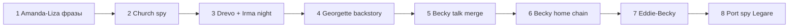

# Импорт контента из `Traktir.qsps` (legacy)

**Статус:** план согласован; **этап A** в QSP (v1); остальное — по `docs/design-port-church-arc.md`.
**Источник:** монолит `Traktir.qsps` (~19k строк), не в сборке.  
**Связь:** `docs/design-mayor-seal-corruption-arc.md` (мэр, церковь, Ирма, слухи).

---

## Принципы адаптации

| Старое | Новая игра | Действие |
|--------|------------|----------|
| `sluttiness`, glory hole | `corruption`, `FamilyCorruptionStage`, лимиты talk | Тексты и цепочки, не механику |
| Жоржетта+Лизетта в трактире | Порт, корабль раз в неделю | Проституцию в зале **не** возвращать |
| Эллона, Кончита, Коитополис | Ильматер + **святилище эльфов** | Лор **переписать** (см. раздел «Религия») |
| Sex-меню старого QSP | Новая sex-система | Только narrative + триггеры |
| `PregnancyCheck`, `pregnancy[]` | **Нет** | **Глобально отключено** — не переносить из legacy, не вызывать в новой sex-системе |

В новой игре беременность **ни у кого** (семья, Ирма, Бекки, порт и т.д.): слишком усложняет баланс и ветки. Тексты legacy про «залетела» — вырезать или заменить. В коде: `sex_scene_core` беременность **намеренно не обрабатывает**; остатки `pregnancy[]` в описаниях — мёртвый путь.

---

## Религия: Ильматер + **Древо** (согласовано)

### Позиция в мире

**Ильматер** — официальная городская вера: воскресная служба, исповедь, мэрия, скандал, пожертвования, отец Герхард. **В воскресенье утром в соборе — весь город.**

**Древо** — эльфийское святилище в порту. **Не одобряется, но не преследуется.** Отдельного жреца/NPC нет — только **Ирма**, и только по расписанию (см. ниже). **Беременности в ветке Древа нет.**

Лор из старого `#FrancheskaTalk` (~9036) → прослушивание у Древа (2 истории за визит) + воскресные слухи при обходе церкви + рынок/Бекки. Пародийные имена и пантеон Эллоны **не** переносим.

---

### Святилище **Древо** — механика (согласовано)

| Параметр | Правило |
|----------|---------|
| Где | Портовый квартал, вход с `Port` |
| Когда | **Ночь**, **только вторник** (`week = 2`) — *«в этот день силы Древа сильны»*; не чаще 1×/календарная неделя |
| Кто | **Ирма**; при **высокой коррупции** — ещё **другие посетители** (без именных NPC на старте) |
| Одежда | Порог **прозрачности** = `IrmaThreshold_Blowjob`; порог **без одежды** = `IrmaThreshold_Sex` |
| ГГ | Минет/секс с Ирмой по порогам; **подсмотреть** или **войти в группу** |
| Высокая коррупция | Ирма обслуживает **не только ГГ**, но и пришедших; ГГ — подсмотреть / присоединиться к групповому |
| Групповые | Счётчик `DrevoGroupSexCount`; при **> 5** в почитании может участвовать **само Древо** (фантазия/ритуал) |
| Рендеры | **Минимум спрайтов** — одна картинка на тип сцены; подсмотр чаще **текст + фон** |
| Отношения | `Friends['irma']` через **лор**: **2 истории за визит**, лимит talk как в проекте |
| Реализация v0 | Секс с ГГ, группа, Древо-участник — **заглушки** (`STUB` в локации) |
| Беременность | **Нет** (глобально, все NPC) |
| Воскресенье | Ирма днём в **соборе** (осмотр), ночью воскресенья у Древа **нет** |

Флаги (черновик): `PlayerKnows_Drevo`, `DrevoVisitCount`, `DrevoLoreHeard[]`, `IrmaDrevoTuesdaySeen[week_index]`, `DrevoWorshipUnlocked`, `DrevoGroupSexCount`, `DrevoTreeActive`, `IrmaShopClientServiceSeen`.

Файлы: `modules/locations/town/drevo_shrine.qsps`, `modules/locations/town/drevo_shrine_text.qsps`, `modules/npc/shops/irma_drevo_talk.qsps`.

Источник текстов лора: урезанный `#FrancheskaTalk` + `#IrmaShortStories` (~11066).

---

### Ирма: собор vs Древо

| Место | Когда | Что может ГГ |
|-------|-------|----------------|
| **Собор** | Воскресенье, утро (`sunday_service`) | Только **осмотр** — Ирма **в тени колонны**, картинка; **без разговора** |
| **Древо** | Ночь, 1×/неделя | Лор; секс с ГГ; при высокой коррупции — другие + подсмотр/группа (заглушка) |

Слух **мэр–Ирма** — через обход церкви, лавки, исповедь; не через talk с Ирмой в соборе.

---

## Ветка Ирмы + ГГ (согласовано)

### Старт отношений

| Параметр | Значение | Смысл |
|----------|----------|--------|
| `IrmaMet` | `0` | ГГ **не знаком** с Ирмой |
| `Friends['irma']` | `5` | Базовый уровень, как у прочих NPC |
| `otkroven['irma']` | `0` | Лор открывается по мере разговоров |
| `sluttiness['irma']` | `38` | Личная распущенность (не = знакомство) |

**Первый визит** — игрок осматривает город **или** пришёл за платьями для танцев **или** за костюмом. Сцена знакомства (`IrmaFirstMeet`): Ирма в разговоре сама обмолвляется, что такому солидному молодому человеку давно пора **новый костюм** (задел под костюм 95 / мэрию / танцы). После сцены `IrmaMet = 1`.

`IrmaRelationship` / `IrmaTrust` при реализации **свести** к `Friends['irma']` (uniform-модуль обновить).

### Talk в лавке (фаза 1)

Только **лор** — очередь тем из `#IrmaShortStories` по `otkroven` / `Friends`:

| Тема | Флаг | Гейт (черновик) |
|------|------|-----------------|
| Отец-эльф | `IrmaKnowDad` | `otkroven >= 18` |
| Мать в трактире | `IrmaKnowMom` | `otkroven >= 22` |
| Своё прошлое | `IrmaKnowSlut` | `Friends >= 18`, `otkroven >= 26` |
| Бесплодие | `IrmaKnowInfertility` | `Friends >= 22` |

Темы **костюм / мэр / униформа / покупки** — **позже**, отдельными этапами.

Лимит talk: как в проекте (1 важный за часть дня, макс. 3 с NPC в день).

### Пороги интима (пока без пересмотра чисел)

| Константа | Значение | Где работает |
|-----------|----------|--------------|
| `IrmaThreshold_Blowjob` | `Friends >= 20` **и** `sluttiness >= 42` | Минет ГГ при **покупке** (примерка) |
| `IrmaThreshold_Sex` | `Friends >= 28` **и** `sluttiness >= 52` **и** `HadSex['irma'] >= 1` | **Только Древо** |
| `IrmaThreshold_HighCorruption` | TBD (черновик: `sluttiness >= 58`) | Лавка: минет **другим клиентам**; Древо: **группа** |

**Мастурбации в лавке нет** — только минет (и позже подсмотр чужого минета).

### Лавка: ширма, покупки, высокая коррупция

**Покупка** = заказ → на следующий день **примерка** у ширмы (как legacy `#DressTry`).

| Действие | Условие | Рендер |
|----------|---------|--------|
| Снять мерку (бельё / нагота) | Заказ оформлен | 1 спрайт примерки |
| **Минет ГГ** | `IrmaThreshold_Blowjob` + примерка при **покупке** | тот же / `sex`-набор Ирмы, без лишних смен |
| **Минет другим клиентам** | `IrmaThreshold_HighCorruption`; Ирма в лавке в рабочее время | **1 общий** фон лавки или ширмы |
| **Подсмотреть** | высокая коррупция; ГГ в лавке, не на примерке | **текст** + опционально тот же фон; без отдельного NPC-спрайта клиента |

Секс в лавке **не** планируется — полный секс только у **Древа**.

**Чаевые после минета** (legacy): +15–20 к счёту; возмущение → `IrmaDeniedTip = 1`, −2 `Friends`, минет при следующих примерках закрыт до извинения/подарка.

**Беременность:** нет (глобальное правило); лор бесплодия Ирмы — только сюжет, без механики.

### Древо: секс, группа, дерево (заглушки)

| Этап | Условие | Действия ГГ | Статус кода |
|------|---------|-------------|-------------|
| Лор | вт ночь, 1×/нед. | 2 истории за визит | план |
| Секс с Ирмой | `IrmaThreshold_Sex` + одежда | участие ГГ | план |
| Другие посетители | `IrmaThreshold_HighCorruption` | **Подсмотреть** или **присоединиться** к групповому | **заглушка** `#DrevoGroupStub` |
| Участие Древа | `DrevoGroupSexCount > 5` | ритуал/фантазия; не отдельный NPC | **заглушка** `#DrevoTreeStub` |

При групповом: `DrevoGroupSexCount += 1`. Порог **> 5** открывает сцену с **участием самого Древа** (ветви, сок, «дыхание» святилища — описание, минимум арта).

Принцип рендеров: не рисовать каждого посетителя — **шёпот за кустами / силуэты / один кадр Ирмы**.

### Экономика (связь, реализация позже)

- Костюм ГГ **95** — мэрия, танцы (`design-mayor-seal-corruption-arc.md`).
- Платья для танцев **~60–90** на девушку.
- Откровенная униформа — после слухов (`IrmaUniformOffer`).

### Файлы ветки (чеклист)

- [x] `modules/locations/shops/irma_first_meet.qsps` — знакомство, реплика про костюм (v1)
- [ ] `modules/npc/shops/irma_talk.qsps` — лор-очередь
- [ ] `modules/locations/shops/irma_fitting.qsps` — ширма, минет ГГ при покупке
- [x] `modules/locations/shops/irma_shop_spy.qsps` — подсмотр минета клиентам (stub v1)
- [x] `modules/locations/town/drevo_group_stub.qsps` — `#DrevoGroupStub`, `#DrevoTreeStub` (stub v1)
- [ ] `modules/core/init_npc/irma_thresholds.qsps` — пороги BJ / Sex / HighCorruption

---

## Воскресная церковь — утренняя служба (согласовано)

Слот: `week = 7`, `time = 1` (`sunday_service` в `npc_city_schedule.qsps`). **Полгорода внутри** — социальный хаб, не заглушка.

### Меню «найти прихожан» (girl-talk стиль, без кнопки «Закрыть»)

| Группа | Действие ГГ | Примечание |
|--------|-------------|------------|
| **Мама + сёстры** (Сандра, Аманда, Мелисса) | **Поболтать** | Семейные темы, лимит важного разговора за слот |
| **Легаре + Кларисса** | **Поболтать** | Одна кнопка — разговор **с парой**; дети Легаре могут быть в **фоновом описании**, отдельного меню для них **нет** |
| **Бекки + дети** | **Поболтать** | Бекки, при необходимости Эдди/Инга по флагам |
| **Жоржетта + Лизетта** | **Поболтать** | Отдельная **городская** группа (не с Амандой); после `LizetteKnown` |
| **Аманда + Лизетта** | **Не в соборе** | Их разговоры — **воскресенье день/вечер** в `AmandaRoom` |
| **Мэр** | **Только осмотр** | Один на **почётном месте**; показ картинки, **без диалога** |
| **Ирма** | **Только осмотр** | **Тень колонны**; картинка, **без диалога** |
| **Гном / Драупнир** | **Нет** | В соборе **не появляется** |

Отец Герхард — отдельно (исповедь в полдень, пожертвования). Утро: фон службы + прихожане.

### Обход собора (слухи)

Помимо разговоров с группами:

- действие **«Пройтись по церкви»** / **«Прислушаться»**;
- выдаёт **слух** (мэр–Ирма, налоги, Жоржетта, порт, семья) — не дублирует полный текст talk;
- лимит **до 3 попыток** за слот; для утренней службы — **отдельный счётчик** `ChurchRumorAttempts_Service[day]` (не общий с полднем/вечером/лавками);
- часть слухов гейтится `PlayerKnows_MayorIrmaAffair`, corruption, сюжетными флагами.

Связь: `sunday_shop_visits` (день/вечер у лавок) остаётся **дополнением**, не заменой церковных слухов.

### Полдень / день / вечер воскресенья

- **полдень** — исповедь, spy (Жоржетта, Лизетта, Бекки);
- **день/вечер** — семейные визиты (`SundayVisitBeckySandra`, `SundayVisitClarissaMelissa`) **и** при `AmandaMetLizette` — **Аманда + Лизетта в `AmandaRoom`** (отдельная кнопка / событие на 2-м этаже);
- лавочные визиты (`sunday_shop_visits`) — дополнение, не вместо комнаты Аманды.

---

## Запрошенные блоки: взять / адаптировать / убрать

### 1. Полная цепочка: корабль → Жоржетта → церковь → подворотня (согласовано)

> **Полная спецификация арки (флаги, PR-порядок, таблицы):** [`docs/design-port-church-arc.md`](design-port-church-arc.md)

Источник legacy: `#PortStreets`, `#Church` / `#ChurchServiceMenu`, `#ChurchIspoved`, `#ChurchAfterCermon`, `#IntGeorgettTalk`, `StreetClients`. **Не** переносим: трактир-проституцию, glory hole, беременность, приглашение в зал.

**Счётчик недель:** удобно вести `PortChurchArcWeek` (+1 каждое воскресенье) или отдельные флаги «доступно с N-го воскресенья после события».

---

#### Этап 0 — Лизетта в порту неявно

Фон, расписание (`$GirlLocation['lizette']` в порту); **без** `LizetteKnown` и **без** знакомства с Амандой, пока ГГ не увидел этап A.

---

#### Этап A — Среда, корабль, Аманда пропала из зала (согласовано)

| Шаг | Условие | Сцена |
|-----|---------|--------|
| A1 | `week = 3`, корабль, `time = 1…3`, `PortMeetWitnessed = 0` | **Аманды нет в зале** днём (`AmandaAtPortShip = 1`) |
| A2 | ГГ в трактире | **Каждую среду** (пока не увидел знакомство): разговор с **Мелиссой** — где Аманда; **Сандра:** отпустила **в порт** на корабль с редкостями; Мелисса: «она молодая, а я уже нет» |
| A3 | ГГ **на причале** у корабля в эту же среду | Сцена знакомства: Аманда и Лизетта у товара; для игрока **заметно появление Лизетты** (визуал/описание) |
| A4 | Роль ГГ | **Не вмешивается** — только смотрит; по завершении сцены → `PortMeetWitnessed = 1`, `AmandaMetLizette = 1`, `LizetteKnown = 1` |
| A5 | ГГ **не** был в порту в среду | Знакомство **не** считается (`AmandaMetLizette` **не** ставится); **следующая среда** — снова A1–A2 и новый шанс A3 |
| A6 | `PortMeetWitnessed = 1` | **Все на местах**: Аманда снова в зале; цикл среды с пропажей **закончен** |

**Важно:** без присутствия ГГ у корабля знакомства **нет** — только повтор по средам.

---

#### Этап B — Жоржетта: днём ищет дочь → ночь в порту

| Шаг | Условие | Сцена |
|-----|---------|--------|
| B1 | `PortMeetWitnessed = 1`; через **`Rand(2, 5)`** календарных дней днём | **Разовый** ивент: Жоржетта **днём** в порту ищет дочь (`GeorgetteSeekLizetteDay`) |
| B2 | Talk | Знакомство с ГГ; **приглашение заходить **ночью**, познакомиться ближе |
| B3 | `time = 5`, `Port` | Жоржетта **ночью**; talk; **подглядеть**; **«снять» за деньги** → секс (`HadSex['georgett']`++) |

**Цены (legacy → новая экономика):**

| Услуга | Legacy | Предложение | Обоснование |
|--------|--------|-------------|-------------|
| Порт, ночь «снять» | **8** | **10** мараведи | костюм 95 ≈ ×9,5; округление; ~3% дневного gross (~341) |
| Собор, секс на службе | **15** | **15** мараведи | премия за риск; **как в старой игре** |
| Порт, Лизетта «снять» (позже, этап G) | **8** | **10** | паритет с матерью |

После первого платного секса в порту: `GeorgettePortSexDone = 1`.

---

#### Этап C — Церковь: Жоржетта одна

| Шаг | Условие | Сцена |
|-----|---------|--------|
| C1 | **Следующее воскресенье** после `GeorgettePortSexDone` | Утро службы: в меню прихожан **Жоржетта одна** (`GeorgetteChurchAlone = 1`); **Лизетты ещё нет** |
| C2 | `Friends['georgett']` высокие, `HadSex['georgett'] >= 3` (legacy) | На службе (утро): предложение секса в углу собора — **15**; `GeorgetteFuckInChurch = 1` |

*Раньше в плане «убрать секс на службе» — для **этой арки** секс **возвращаем** по legacy, с гейтами и ценой.*

---

#### Этап D — Полдень воскресенья: исповедь + прогулка (согласовано)

| Шаг | Условие | Сцена |
|-----|---------|--------|
| D1 | **+1 воскресенье** после C | Слот **`sunday_confession`** (`time = 2`) |
| D2 | Один полдень | ГГ может **и исповедаться, и прогуляться** у церкви **в том же слоте** (не тратить второй полдень) |
| D3 | Исповедь | Меню по `HadSex[*]`: Жоржетта; на службе; на глазах у дочери (позже); другие девушки — по мере накопления |
| D4 | Прогулка / шпионить | Если **нет** доступного spy — обычная прогулка, осмотр церкви; если есть гейт — подсмотр (этапы E, G) |
| D5 | Задел | `PriestConfessionCorruption` — чем больше откровенных рассказов ГГ о разных девушках, тем сильнее священник «развращает остальных» (**позже**, механика не в v1) |

Флаги: `GeorgetteConfessBasic`, `GeorgetteConfessInChurch`, `GeorgetteConfessLizaSaw`.

---

#### Этап E — Подсмотр: священник + Жоржетта

| Шаг | Условие | Сцена |
|-----|---------|--------|
| E1 | **+1 воскресенье** после D, `GeorgetteConfessBasic = 1` | **Полдень:** «Прогуляться возле церкви» → `ChurchAfterCermon` → spy **Жоржетта + отец Герхард** |
| E2 | Ночь, порт, talk | Жоржетта: «Ты на исповеди всё рассказал, **с меня не убудет**» |

---

#### Этап F — Лизетта на службе, дочь смотрит

| Шаг | Условие | Сцена |
|-----|---------|--------|
| F1 | **+1 воскресенье** после E | На **утренней службе** появляется **Лизетта** (с Жоржеттой) |
| F2 | Секс с Жоржеттой на службе (снова) | Лизетта может **смотреть** / ласкать себя → `LizaSawSexInChurch = 1` (legacy `lizasawinchurch`) |
| F3 | **+1 воскресенье**, исповедь | Покаяние: трахал Жоржетту **на глазах у дочери** → `GeorgetteConfessLizaSaw = 1` |

**Секс ГГ с Лизеттой (intim, не платный «снять»):** гейт **`LizetteSexUnlocked`** — только после церковной цепочки (исповедь/spy), **не** на этапе B.

---

#### Этап G — Подсмотр: священник + Лизетта

| Шаг | Условие | Сцена |
|-----|---------|--------|
| G1 | **+1 воскресенье** после F3 | Полдень: прогулка у церкви → spy **Лизетта + священник** |
| G2 | Ночь, порт, talk с Жоржеттой | «Девочка созрела, пусть идёт **работать со мной**» → `LizetteProstPort = 1` (legacy `ProstStart`) |

---

#### Этап H — Обе ночью в порту, подворотня

| Шаг | Условие | Сцена |
|-----|---------|--------|
| H1 | После G2 | **Ночь:** Жоржетта **и** Лизетта; выбор **одной** → «снять» **10** / секс |
| H2 | Подворотня | Если одной нет на причале — **подворотня** (`port_alley_spy`): **рандомный клиент** + Жоржетта или Лизетта |
| H3 | Задел | Приглашение в **трактир** (legacy) — **не** в v1; **поздний этап** игры |

**Клиенты в подворотне (рандом, текст):** старик, моряки, горожанин, молодой парень, **священник (редко)**; из именных без гейта: **Легаре** (любит молоденьких), **Эдди**, др. — **не** только они.

Подворотня v1: текст + слух/`TavernScandal`; без спрайта клиента; `Rand` по таблице клиентов.

---

#### Связь с Амандой и воскресеньем

- **Собор утром:** семейные группы; Жоржетта+Лизетта — **отдельно** после F1.
- **Воскресенье день/вечер:** Аманда+Лизетта в `AmandaRoom` (болтовня по `sluttiness['amanda']`).
- **Трактир:** подслушивание → ГГ **уходит**; запрет встреч **позже**.

---

#### Закрыто (уточнения игрока)

| # | Решение |
|---|---------|
| 1 | **Без ГГ у корабля знакомства нет**; Лизетта должна **заметно** появиться в сцене witness |
| 2 | **Каждая среда** днём — пропажа Аманды + talk Мелиссы/Сандры, пока `PortMeetWitnessed = 0`; потом все **на местах** |
| 3 | **Исповедь в полдень**; в **один** полдень можно **и** исповедаться **и** прогуляться/шпионить; пустая прогулка — осмотр церкви; задел `PriestConfessionCorruption` |
| 4 | Трактир-проституция — **задел на позднюю игру**, v1 **не** переносим |
| 5 | **Легаре** в подворотне **без** гейта `AmandaLegare` (любит молоденьких) |
| 6 | Задержка Жоржетты: **`Rand(2, 5)`** дней после witness |
| 7 | Подворотня: **рандомные** клиенты (старик, моряки, горожанин, парень, редко священник) + именные в пуле |

---

#### Файлы (чеклист)

- [x] `modules/events/tavern/amanda_port_ship_hint.qsps` — Мелисса/Сандра, среда (v1)
- [x] `modules/events/port/port_amanda_lizette.qsps` — witness-only, повтор по средам (v1)
- [ ] `modules/events/georgette/georgette_seek_lizette.qsps` — дневной разовый ивент
- [ ] `modules/events/georgette/georgette_port_night.qsps` — ночь, снять **10**
- [ ] `modules/events/church/church_georgette_service_sex.qsps` — служба **15**
- [ ] `modules/events/church/church_confession_dynamic.qsps` — меню по `HadSex`
- [ ] `modules/events/church/church_spy_georgette.qsps`, `church_spy_lizette.qsps`
- [ ] `modules/events/port/port_alley_spy.qsps` — Legare/Eddie и др.
- [ ] `LizetteSexUnlocked` — после церковной цепочки; платный порт Лизетты — после `LizetteProstPort`

---

### 2. Аманда + Лизетта — болтовня **после** порта (согласовано)

**Где бывает:** трактир / 2-й этаж (подслушивание); **воскресенье день и вечер** — **комната Аманды** (`AmandaRoom`, не собор).

#### Откровенность тем (п.1)

| Кто | Правило |
|-----|---------|
| **Аманда** | **Уровень откровенности фраз** растёт вместе с **`sluttiness['amanda']`** (личная коррупция): чем выше — тем смелее темы из legacy |
| **Лизетта** | **Выше по умолчанию** (дочь Жоржетты): старт `otkroven['lizette']` > `otkroven['amanda']`; в диалогах она **ведёт** и **раньше** переходит к откровенным темам |

Черновик гейтов фраз (подборка из `#InitAmandaLizaTalkItems`):

| `sluttiness['amanda']` | Примеры тем |
|------------------------|-------------|
| низкая, после порта | Наивные вопросы (дети, анатомия) |
| ~15+ | «Ты со Стефаном…?», первый раз |
| после harassment | Запреты ГГ (Легаре, мальчики, Лизетта) |
| параллель Legare | Внимание Легаре, «дай ему» → `AmandaLegare*` |
| высокий `AmandaLizaInfluence` | «Хочу быть как ты» |

Лизетта может **произносить** более откровенные реплики при **меньшем** `sluttiness` у Аманды — за счёт своего базового `otkroven`.

#### Подслушивание (п.2)

ГГ **подслушал** разговор (трактир / 2-й этаж) → единственная немедленная реакция: **уйти** (не вмешиваться в сцену).

**Запрет встреч** с Лизеттой — **отдельно, позже** (после ухода или в другой сцене policy): флаг вроде `AmandaLizetteMeetingsBanned` / связка с `PlayerCantForbidGirlMeetings` из арки мэра. Не в тот же клик, что «уйти».

Лимит: 1 важное событие за слот, как у остальных talk.

#### Воскресенье (п.3)

| Слот | Аманда + Лизетта |
|------|------------------|
| Утро, собор | **Нет** совместного talk — только **семейный принцип** (Аманда в группе мама+сёстры) |
| День / вечер | **Да** — болтовня **в `AmandaRoom`**; контент из `amanda_lizette_phrases` + рост тем по `sluttiness['amanda']` |

**Адаптировать:** ночной визит → `FamilyTension`, без glory hole.

**Убрать:** glory hole (~1427–1466); беременность; «мамка дядям отсасывает».

**Куда:** `amanda_lizette_phrases.qsps`, хуки в `amanda_events.qsps`, `AmandaRoom` (воскресные визиты).

---

### 3. История мира (бывш. Франческа)

См. раздел **«Религия»** выше. Отдельный NPC-болтушка **не обязателен**, если лор разнесён: Родник + воскресные слухи + разговоры Бекки/Эдди.

---

### 4. Жоржетта и Бекки — диалоги с ГГ

**Жоржетта:** см. **§1в** (порт, ночь, talk без оплаты). Кратко: биография, клиенты, дети, Лизетта, церковь, Эдди — **взять**; трактир / glory hole / прайс — **убрать**.

**Бекки (`#IntBeckyTalk`):** Инга, Эрик, Грета, Эдди, Шервуд/Робин — **взять** (частично дублирует `talk_with_becky.qsps` — **слить тексты**). Ветка «отдаться сыну» + совет священника — **адаптировать** под церковь.

---

### 5. Бекки + ГГ

**Взять:** `BeckyInviteHome`, ужин, маскировка «оптовый клиент», эскалация `visitedhome`, проверка костюма.

**Адаптировать:** `IntBeckySex` → новая sex-система; `becky_events.qsps` — объединить с `visitedhome`.

**Убрать/смягчить:** `GeorgettBeckyVisit` — оргия за столом; оставить намёк или урезанную сцену.

---

### 6. Бекки + Эдди

**Взять цепочку:** `IntEddieTalk` (взгляды, Жоржетта-мама) → подстава с дверью → `PriestAdvice` → `BeckyEddieJoinFirst` → нормализация.

**Убрать:** детальное `IntEddieBeckySex` menu — narrative 2–3 шага.

---

### 7. Церковь: служба + подглядывание

**Утро (новое, приоритет):** меню прихожан и обход со слухами — см. раздел **«Воскресная церковь»** выше. Импорт текстов из старого `#Church` (~7158), меню семей/Бекки/Жоржетты.

**Полдень (старый скелет):**

```
Исповедь → ChurchAfterCermon → spy (Жоржетта / Лизетта / Бекки)
→ IntGeorgettTalk (мать узнаёт про дочь)
```

**Убрать:** гном в соборе. **Секс на службе** — только **арка Жоржетты** (§1, этап C/F), платно **15**, с гейтами — не свободный хаб.

**Исповедь / обход:** см. §1 этапы D–G (`church_confession_dynamic`, `ChurchAfterCermon`).

**Куда:** `church_sunday_service.qsps`, `church_sunday_rumors.qsps`, `church_spy_*.qsps`, заменить заглушку `modules/locations/town/church.qsps`.

---

### 8. Жоржетта + ГГ + трактир (`#SexProstTavern`)

**Убрать** как систему. Идея «дешевле/комната» → **порт**, не зал трактира.

---

## Дополнительно забрать (рекомендация)

| Блок | Зачем |
|------|--------|
| `StreetClients` (~7835), Лизетта+Легаре | `AmandaLegareInterest`, порт |
| `Church` меню прихожан (~7186) | Воскресный UI |
| `IrmaShortStories` (~11066) | Ирма: отец-эльф, мать, Родник |
| `IntAlberTalk`, `IntZimmerTalk` | Легаре, стража, Шервуд |
| `ShowChurchDraupnirList` | Пожертвования + Драупнир |
| `EventWaitressHarrass` + aftermath | Сверить с новым hall |

---

## Приоритет реализации



1. Таблица Amanda+Liza (без glory).
2. **Воскресная служба** (прихожане + обход слухов) + полдень spy.
3. **Древо** (ночь 1×/нед., Ирма, лор 2/визит).
4. Биография Жоржетты.
5. Тексты Бекки в `talk_with_becky`.
6. Дом Бекки.
7. Бекки+Эдди+священник.
8. Портовое подглядывание (Легаре).

---

## Черновик: лор у **Древа** (2 истории за визит)

*(для `drevo_shrine_text.qsps`; темы из Francheska/Irma, без старых имён)*

Примеры пар за один ночной визит:

1. **Отец-эльф** + **мать в трактире** (`IrmaShortStories`).
2. **Герцогиня и торговые пути** + **король и налоги на «порок»** (укороченный Francheska).
3. **Почему Древо в порту** + **почему Ильматер в соборе** (двойная вера без исповеди).

Позже: «почитание» — секс с ГГ → группа с посетителями (`DrevoWorshipUnlocked`) → при `DrevoGroupSexCount > 5` участвует **само Древо** (заглушки).

В **соборе** Ирма **не** объясняет Древо вслух — только осмотр в тени колонны.

---

## Открытые вопросы

1. Число `IrmaThreshold_HighCorruption` (черновик `sluttiness >= 58`).
2. Таблица весов клиентов подворотни; реализация `PriestConfessionCorruption` (задел).
3. Тексты 2 лор-историй за визит к Древу (очередь тем из Francheska/Irma).
4. Тексты лор-talk; заглушки группы/Древа; `georgette_port_night`.

**Закрыто:**

- **Ирма + ГГ:** не знакомы при старте; знакомство при первом визите; в talk пока **только лор**.
- Пороги BJ/секс: **20/42** и **28/52** (секс **только Древо**).
- Лавка: **только минет** (при покупке ГГ; при высокой коррупции — **клиентам**, **подсмотр**); **мастурбации нет**; чаевые +20 — **да**.
- **Меньше рендеров** — один кадр на тип сцены; клиенты/толпа — текст и силуэты.
- Древо: при высокой коррупции — **не только ГГ**; подсмотр / **групповой**; при **>5 групповых** — **Древо**; группа и дерево — **заглушки**.
- **Беременность:** **нет** в игре целиком.
- **Порт–церковь арка:** §1 (среда, witness, Жоржетта, церковь по неделям, подворотня); порт **10**, собор **15**; **intim Лизетты — только церковь**.
- **Аманда+Лизетта:** откровенность тем ∝ `sluttiness['amanda']`; у Лизетты `otkroven` выше с старта; подслушал → **уйти**, запрет встреч **позже**; воскресенье **день/вечер** — `AmandaRoom`; в соборе — **по семьям**, не вместе.
- Древо: **вторник**, ночь (`week = 2`).
- Одежда у Древа: пороги = минет / секс (общие константы).
- Слухи в соборе: счётчик **отдельный** для утренней службы.
- Легаре: talk **только пара** с Клариссой; дети — фон, без отдельного talk.

---

## Файлы при реализации (чеклист)

- [ ] `modules/npc/amanda/amanda_lizette_phrases.qsps`
- [ ] `modules/events/church/church_sunday_service.qsps` — меню прихожан
- [ ] `modules/events/church/church_sunday_rumors.qsps` — обход собора
- [ ] `modules/events/church/church_sunday_rumors_text.qsps`
- [ ] `modules/events/church/church_spy_georgette.qsps`
- [ ] `modules/events/church/church_spy_lizette.qsps`
- [ ] `modules/events/church/church_spy_becky.qsps`
- [ ] `modules/locations/town/drevo_shrine.qsps`
- [ ] `modules/locations/town/drevo_shrine_text.qsps`
- [ ] `modules/npc/shops/irma_drevo_talk.qsps`
- [ ] `modules/events/georgette/georgette_backstory_text.qsps`
- [ ] Дополнение `modules/actions/dialogs/talk_with_becky.qsps`
- [ ] `modules/events/becky/becky_home_chain.qsps`

*Подключение папок в `qsp-project.json` не менять без явной просьбы — файлы класть в уже connected `modules/events`, `modules/locations`, `modules/npc`.*